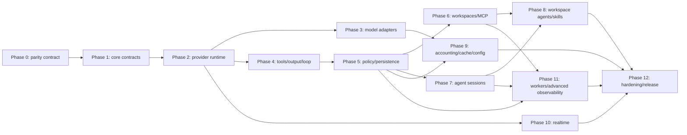

# Blackbox TypeScript Feature-Parity Plan

**Status:** Proposed implementation plan
**Analysis date:** 2026-07-14
**TypeScript baseline:** `blackbox-ts` commit `fbe3ebf1add1d7686f4d07dcd8092119d5a02b7b`
**Parent baseline:** `tyxter-dev/blackbox` commit `f27decbc9aeaae972c5bbeb256c70450b7fe393a`

## 1. Goal and parity definition

The goal is behavioral feature parity with the Python parent, not a line-for-line
translation. TypeScript naming and implementation details may differ, but the two
libraries should expose equivalent concepts, lifecycle semantics, capability honesty,
provider behavior, event meaning, error behavior, persistence guarantees, and test
coverage.

Parity means all of the following:

1. A parent feature marked **Supported** is implemented and verified in TypeScript.
2. A parent feature marked **Partial** or **Contract only** has the same honest status in
   TypeScript; the TS package must not advertise behavior the parent does not provide.
3. Stable wire values are identical where consumers may exchange data across languages:
   event type strings, provider refs, lifecycle/status values, serialized state, artifacts,
   and error codes.
4. TypeScript-native replacements are allowed where Python runtime types do not translate
   directly. For example, Pydantic/dataclass output validation becomes a generic runtime
   schema/validator contract plus JSON Schema support.
5. `OpenRouterProvider` remains a TypeScript extension. It must follow the same provider
   contracts but is not counted as parent parity.

### Source-of-truth order

The parent PRD is still marked **Draft** and predates several shipped features. Use this
order when sources disagree:

1. Parent implementation and tests at the pinned parent commit.
2. Parent `FEATURES.md` for current support status.
3. Parent split PRD under `docs/prd/` for architecture and feature semantics.
4. Parent `docs/PRD.md` for original P0/P1/P2 requirements.
5. Parent `ROADMAP.md` for explicitly unfinished work.

The pinned baseline contains 143 catalogued features: 137 supported, 3 partial, 2
contract-only, and 1 explicitly unsupported. Realtime, workflow configuration, prompt
planning, and some integration surfaces must also be tracked because they shipped after
the original feature table was created.

## 2. Current coverage assessment

Strict parent parity is not yet achieved in any complete subsystem. The current package
contains useful foundations, but most are narrower contracts or text-only compatibility
implementations.

| Domain                            | Current TS status      | Main gap                                                                                                                            |
| --------------------------------- | ---------------------- | ----------------------------------------------------------------------------------------------------------------------------------- |
| Core events/state/errors/content  | Partial                | Event envelope and taxonomy, durable items, sessions, artifacts, approvals, raw envelopes, and multimodal contracts are incomplete. |
| Provider registry and refs        | Partial                | Model providers only; no agent/realtime registries; legacy `/` refs are missing.                                                    |
| Model catalog                     | Partial                | No bundled catalog, lifecycle breadth, modalities, replacement, or provenance.                                                      |
| Capability model                  | Partial/mismatched     | Explicit controls can be silently ignored; no constraints, output fallback, state modes, or full negative contract suite.           |
| Model runtime facade              | Missing                | No `runtime.models.run/stream`; provider streaming is optional instead of canonical.                                                |
| Model adapters                    | Partial                | Non-streaming text mappings; OpenAI/xAI use Chat Completions rather than Responses; no native tools/state/structured output.        |
| High-level agent loop             | Missing                | No `AgentRuntime.run/stream`, `AgentLoop`, continuation loop, typed result, fallback, or iteration guard.                           |
| Tools and hosted tools            | Missing/contracts only | No registry/runtime, context injection, execution, toolsets, routing, budgets, or hosted-tool mapping.                              |
| Structured output                 | Missing/contracts only | No runtime validator, output strategies, repair loop, or provider-native mapping.                                                   |
| Policy and approvals              | Missing                | No policy checkpoints or pause/resume state machine.                                                                                |
| Persistence                       | Missing                | No event/run/session/cache stores or replay.                                                                                        |
| Agent sessions/providers          | Missing                | No `AgentProvider`, local sessions, cloud providers, artifacts, cancellation, resume, or webhooks contract.                         |
| Workspaces/artifacts              | Missing/contracts only | No provider abstraction or local/git/sandbox/Docker/cloud operations.                                                               |
| MCP                               | Missing/contracts only | No transports, client/server, auth, trust, caching, tool bridge, or toolset routing.                                                |
| Workspace agents/skills/schedules | Missing                | No portable packages, validation, registry, skill compiler, or schedule executor.                                                   |
| Usage/pricing/cache               | Partial/missing        | Basic tokens only; no cache splits, pricing, markup, cache registry, or lifecycle.                                                  |
| Observability                     | Missing                | No sinks, trace context, redaction, metrics, replay/diff, or eval hooks.                                                            |
| Realtime                          | Missing                | No separate protocol/runtime, providers, or realtime event family.                                                                  |
| Environment workers               | Missing                | No work-source contract, leasing worker, governance, or provider adapter.                                                           |
| Compatibility                     | Partial                | `complete()` exists, but no explicit chat facade or migration projections.                                                          |

### Original PRD requirements

Legend: **Partial** means some type or behavior exists but does not satisfy the parent's
acceptance criteria.

| Requirement group   | Implemented | Partial | Missing |
| ------------------- | ----------: | ------: | ------: |
| P0, 17 requirements |           0 |       8 |       9 |
| P1, 13 requirements |           0 |       3 |      10 |
| P2, 10 requirements |           0 |       2 |       8 |

P0 partial foundations are the model-only registry, model-provider shape, event shape,
provider-state type, non-streaming turn collection, capability profile, test scaffold, and
some negative capability checks. P1 partial foundations are the OpenAI, Anthropic, and
Gemini adapters. P2 partial foundations are basic usage extraction and completion/chat-like
compatibility.

## 3. Target architecture

### 3.1 Package boundaries

Mirror the parent's domain boundaries while keeping one npm package and subpath exports:

```text
src/
  core/                 events, items, state, sessions, artifacts, raw, errors,
                        capabilities, approvals, accounting, cache, content
  runtime/              AgentRuntime, AgentLoop, facades, configuration
  providers/
    model-adapters/     OpenAI, xAI, Anthropic, Gemini, Echo, OpenRouter extension
    agent-adapters/     Local, OpenAI Agents, Claude Code, Vertex stub
  tools/                local registry/runtime, tool sessions, toolsets, hosted tools
  output/               schema conversion and validation
  planning/             resolved run specs, prompt composition, parity checks
  mcp/                  specs, client/server, transports, auth, trust, caches, toolsets
  workspaces/           local, git, sandbox, Docker, cloud providers
  workspace-agents/     package contracts, validation, registries, schedules
  skills/               SKILL.md loading, compilation, staging
  pricing/              provider model and monetary catalogs
  observability/        sinks, traces, metrics, replay, evals, presets
  realtime/             protocol, runtime, fake/OpenAI/Gemini providers
  workers/              work sources and environment worker
  integrations/         optional client/SDK builders
  compat/               explicitly lossy migration projections
  testing/              fakes, clocks, scripted providers, fixtures, contract suites
```

### 3.2 Load-bearing contracts

Implement these before higher-level behavior:

- `ModelProvider.streamTurn(request): AsyncIterable<AgentEvent>` is canonical.
- `ModelRuntime.run()` is a collector over `streamTurn`; it must not be implemented as a
  separate provider code path.
- `AgentProvider` owns agent/session lifecycle and remains separate from model turns.
- `RealtimeProvider` remains a third, separate protocol family.
- `AgentLoop` is the single local tool-loop implementation used by both
  `AgentRuntime.run()` and `LocalAgentProvider`.
- Events and `RunItem`s are canonical state; chat messages are compatibility projections.
- `ProviderState` stores provider-native continuation, never reconstructed chat history.
- Stable serialized contracts retain snake_case wire keys for cross-language compatibility;
  TypeScript methods may use normal camelCase naming.
- All normalized objects preserve raw provider payloads. `RawEnvelope` controls sensitivity
  and redaction without deleting source data.

### 3.3 Dependency policy decision

The core package should keep zero hard runtime dependencies. Fetch-first model adapters,
tool execution, JSONL stores, local workspaces, most MCP transports, and core observability
can use Node/platform APIs.

Exact parity creates three cases that Node 20.11 does not cleanly cover:

- SQLite persistence,
- production OpenTelemetry exporters and cloud-agent SDK bridges,
- portable zip packaging and production WebSocket transports.

Recommended policy:

1. Keep `dependencies` empty for the core package.
2. Define injected client/transport/store interfaces first and test them with fakes.
3. Put production bridges behind explicit subpath imports and optional peer dependencies, or
   raise the Node baseline where a stable built-in exists.
4. Never import an optional integration from the root entrypoint.
5. Require an explicit repository-policy decision before adding the first optional peer.

This decision is a Phase 0 gate because it affects SQLite, realtime, cloud agents, package
archives, and OpenTelemetry.

## 4. Dependency sequence



## 5. Phased implementation roadmap

### Phase 0 — Freeze the parity contract and delivery mechanics

**Objective:** Prevent the TypeScript port from chasing a moving parent or freezing the
wrong public API.

**Deliverables**

- Add a machine-readable parity inventory for all 143 catalogued parent features plus
  realtime, workflow profiles, prompt planning, skills, and environment workers.
- Record the parent commit for every parity release.
- Add ADRs for protocol separation, event-first state, raw payloads, provider state,
  structured output, provider ref syntax, and optional integration dependencies.
- Decide Node support and the SQLite/WebSocket/zip/OTEL integration strategy.
- Decide public naming/serialization rules and compatibility deprecation policy.
- Add GitHub CI before feature implementation: Windows and Linux, supported Node versions,
  typecheck, lint, formatting, tests, build, package dry-run, and consumer import smoke test.
- Create the actual GitHub repository and fix install documentation.

**Acceptance gates**

- Every parent feature has an owner phase and an explicit target status.
- No parity requirement depends on an unresolved architectural decision.
- `pnpm format:check` joins the mandatory release checks and passes.
- CI runs without provider credentials and performs no network calls by default.

### Phase 1 — Rebuild provider-neutral core contracts

**Objective:** Establish wire-compatible, serializable contracts before adapter work.

**Deliverables**

- Full `AgentEvent` envelope: ID, type, run/session/item IDs, sequence, trace/span context,
  provider correlation IDs, data, raw payload, and timestamp.
- Full canonical event taxonomy, including reserved handoff/agent-tool and realtime families.
- `RunItem` and item taxonomy.
- `ProviderState`, `RunState`, session/ref/invocation types, status transitions.
- `Artifact`, `ArtifactRef`, `ArtifactPage`, patch/file/command artifact types.
- `ApprovalRequest`, `ApprovalDecision`, `PolicyDecision`, checkpoint constants.
- `RawEnvelope` with sensitivity and storage policy.
- Typed error hierarchy matching parent semantics and stable error codes.
- Multimodal content: text, image, audio, video frame, file, tool result, and provider-native
  parts. Unsupported parts must throw; they must never disappear during mapping.
- `ModelUsage` with input/output/cache/reasoning/tool-call details.
- `TurnRequest`, nested `ModelRequestControls`, `TurnResult`, `AgentResult<T>`, and
  `AgentSessionResult<T>`.
- Versioned JSON serialization and round-trip helpers for durable types.

**Acceptance gates**

- Cross-language fixture tests load Python-produced JSON and reproduce the same normalized
  TypeScript values.
- Every value/status/event constant has a snapshot test.
- Raw payloads survive normalization and serialization where storage is allowed.
- No public request field can be silently ignored.

### Phase 2 — Provider runtime, registry, catalogs, and capability honesty

**Objective:** Make provider execution event-first and enforceable before adding breadth.

**Deliverables**

- Registry with separate model, agent, and realtime namespaces plus deduplicated close hooks.
- Canonical `provider:model` parsing and legacy `provider/model` compatibility.
- Provider model catalog with aliases, lifecycle, replacements, modalities, capacity, and
  provenance; generate a bundled snapshot from checked-in data.
- `ModelProvider`, `AgentProvider`, `AgentWebhookProvider`, and `RealtimeProvider` contracts.
- `ModelRuntime` facade with `run`, `stream`, capability lookup, provider-state collection,
  and typed configuration errors.
- Granular `ModelCapabilityProfile`: hosted tools, output strategies, controls, state modes,
  supported values, incompatibilities, cross-feature constraints, source, and metadata.
- Capability profile derivation for compatibility providers.
- Output fallback resolution and state-mode validation.
- `EchoModelProvider`, `ScriptedModelProvider`, fake agent/realtime providers, fake clocks,
  and reusable contract suites.

**Acceptance gates**

- Every advertised false/unsupported capability has a shared negative test proving failure
  before fetch/SDK dispatch.
- Passthrough is accepted only for explicitly raw/provider-native inputs that are actually
  forwarded.
- Provider contract suites run against every model adapter.
- Registry and catalog behavior matches cross-language fixtures.

### Phase 3 — Native streaming model adapters

**Objective:** Reach parent parity for the four parent model providers, then rebase the
OpenRouter extension on the same contracts.

**Shared transport work**

- Streaming HTTP/SSE decoding, cancellation, timeouts, retry classification, retry-after,
  safe error bodies, request IDs, and injectable `fetchImpl`.
- Provider-specific request merging with an explicit collision policy for `extra`.
- Multimodal mapping and typed unsupported-part errors.
- Usage, cache, provider state, raw events, and final result collection.

**Provider slices**

1. **OpenAI Responses**: text/reasoning deltas, stable output items, function calls/results,
   hosted tools, tool search, remote MCP, structured output, include/store/background,
   truncation/compaction, prompt cache controls, and `previous_response_id`.
2. **xAI Responses**: reuse protocol mechanics without inheriting OpenAI identity or
   capability claims; keep conservative hosted-tool/MCP support.
3. **Anthropic Messages**: streaming blocks, tool use/results, thinking, hosted/server tools,
   remote MCP, structured output by model, compaction by model, caching, and native history.
4. **Gemini GenerateContent**: ordered parts, function-call IDs, function responses, thought
   signatures, grounding/source metadata, hosted web search, structured output constraints,
   context cache lifecycle, and provider state.
5. **OpenRouter extension**: preserve aggregator identity and raw routing metadata; implement
   only capabilities actually mapped by its adapter.

**Acceptance gates**

- Golden tests cover representative raw streams and exact normalized event sequences.
- Every emitted event retains the corresponding raw provider object/payload.
- Default tests remain offline; live tests are individually environment-gated.
- Request-control tests prove every supported field is sent and every unsupported field
  throws.
- Cancellation and timeout tests prove underlying requests are aborted.

### Phase 4 — Tools, structured output, and the complete AgentLoop

**Objective:** Restore the parent's primary product promise: task + tools + schema in,
validated result out.

**Tool system**

- `ToolDefinition`, metadata, JSON Schema override, registry, lookup, export, and isolated
  per-run `ToolSession`.
- Sync/async handlers, timeout, concurrency, blocking offload, mock execution, coercion, and
  typed `ToolResult` with model-facing content and app-facing payload separation.
- Context injection by parameter name while keeping private parameters out of provider
  schemas.
- Multiple calls per turn and deterministic result ordering.
- Tool catalog, search/load meta-tools, toolsets, visible/call/parallel/schema budgets,
  routing telemetry, and visible-surface persistence.
- Typed hosted tool specs distinct from local tools.

**Structured output**

- Generic `OutputSchema<T>` containing JSON Schema plus a runtime parser/validator.
- Dependency-free validation for the JSON Schema subset implemented by the parent.
- Structural adapters for third-party TS validators without importing them from core.
- `OutputSpec<T>` with provider-native, finalizer-tool, post-hoc, and repair/retry strategies.
- Fail-fast `OutputValidationError` with raw text and cause.

**AgentLoop and runtime**

- One state machine for model turns, tool detection, policy checks, execution, tool-result
  continuation, approvals, finalization, validation, failure, cancellation, and iteration
  limits.
- `AgentRuntime.run/stream` and `runtime.tools`.
- Provider fallback routing only for configured/provider execution failures; never for
  capability or validation errors; preserve attempt metadata.
- Prompt planning and event emission hooks, without duplicating provider logic.

**Acceptance gates**

- Deterministic tests cover text-only, one tool, parallel tools, context privacy, payloads,
  mocks, timeout, cancellation, max iterations, all output strategies, repair exhaustion,
  and fallback eligibility.
- `run()` is a collector over the exact same event stream returned by `stream()`.
- Callers never manually parse a tool request or append a tool result in the documented path.

### Phase 5 — Policy, approvals, persistence, and baseline observability

**Objective:** Make runs resumable, governable, and inspectable before sessions/workspaces
depend on them.

**Deliverables**

- Policy protocol and checkpoints for tool, hosted tool, MCP, workspace write/command,
  artifact export, final output, scheduled run, and inbound work claim.
- Approval manager with allow/deny/require-approval, modified arguments, pause/resume, and
  canonical events.
- `EventStore`, `RunStore`, `SessionStore`, and `ProviderCacheStore` interfaces.
- In-memory implementations with injected clocks and ordered cursor behavior.
- JSONL event/session stores with atomic append and corruption handling.
- SQLite implementations through the approved optional integration strategy.
- Resume from persisted provider state and run checkpoints.
- Event sinks: callback, memory, JSONL; fan-out and failure isolation.
- Trace stamping and raw-payload redaction wrappers.

**Acceptance gates**

- Store contract tests run against every backend.
- Resume tests create a fresh runtime, load persisted state, and continue natively.
- Approval state survives persistence and rejects duplicate/unknown decisions.
- Secret/raw redaction tests prove source events are preserved while exported telemetry is
  sanitized.

### Phase 6 — Artifacts, workspaces, and MCP security boundary

**Objective:** Add provider-neutral environments and connector execution without weakening
policy or trust boundaries.

**Workspaces**

- Workspace contracts for local, git, sandbox, Docker, cloud, mounted artifact bundles, and
  opaque remote refs.
- Runtime facade and provider registry.
- Local provider: safe file read/write/delete, commands, patches, snapshots, artifact listing,
  and canonical events.
- Git checkout/provider, Docker provider, injected sandbox provider, and opaque cloud refs.
- Path containment, command timeout/cancellation, patch validation, policy/approval gates.
- Workspace-to-tool compatibility bridge.

**MCP**

- `MCPServerSpec` for stdio, HTTP, SSE, and streamable HTTP.
- Protocol-version matrix and negotiated initialization.
- MCP client, local server authoring, decorators/schema helpers, and result normalization.
- Namespaced `mcp:<server>.<tool>` identities.
- OAuth bearer/token-provider interface, one-shot auth refresh, actionable auth errors, and
  secret-safe representations.
- Trust presets, local/remote/provider-native boundary checks, allow/deny filters, scopes,
  risk metadata, timeouts, output caps, redaction, and discovery cache invalidation.
- Runtime tool bridge and `MCPToolset` routing between local dispatch and provider-native
  `RemoteMCP`.

**Acceptance gates**

- Security tests cover path traversal, command cancellation, token leakage, untrusted remote
  MCP, auth cache identity, oversized output, protocol mismatch, and `listChanged` invalidation.
- MCP trust is evaluated before tools become model-visible.
- Provider-native MCP and runtime-local MCP remain distinct execution paths.

### Phase 7 — Agent sessions and cloud-agent providers

**Objective:** Reach session-first supervision parity without modeling cloud agents as tools.

**Deliverables**

- `AgentProvider` session lifecycle, `runtime.agents` facade, and strict status state machine.
- `LocalAgentProvider` delegating to the shared `AgentLoop`.
- Create/start, stream, run/collect, replay, send-message idempotency, approve, cancel, resume,
  and paginated artifacts.
- Durable session cursor mappings, invocation state, approvals, workspace/MCP state, provider
  state, and artifact refs.
- `OpenAICloudAgentProvider` through an injected client contract plus optional production
  bridge; sessions, events, HITL, artifacts, cancellation, MCP definitions, continuation.
- `ClaudeCodeAgentProvider` through injected client/CLI/optional SDK bridge; API-key and
  subscription auth selection, sessions, workspace/tool events, approval, artifacts,
  cancellation, resume, and version-skew-safe options.
- Honest `VertexAIAgentEngineProvider` stub to match the parent's current partial status.
- `AgentWebhookProvider` and ingestion persistence contract only, matching the parent's
  current contract-only status.

**Acceptance gates**

- Shared agent-provider contract suite and golden fake-client suites.
- Terminal stored sessions replay without contacting providers.
- Live resume is advertised only where implemented.
- Session collector produces `AgentSessionResult<T>` with strict status, artifacts, trace,
  usage, state, and metadata.

### Phase 8 — Workspace-agent packages, skills, registries, and schedules

**Objective:** Port the parent's distributable/governed agent package layer.

**Deliverables**

- `WorkspaceAgentSpec`, connectors/auth modes, permissions, schedules, publication metadata,
  skills, serialization, and registry interfaces.
- Validation for duplicates, unresolved tools/connectors/MCP, permission mismatches, models,
  schedule syntax/timezone, and skill sources.
- In-memory and SQLite versioned registries with publish/deprecate/visibility semantics.
- Directory package format with `agent.json`, `instructions.md`, and embedded skills.
- Pack/unpack/install with format-version checks and archive traversal protection.
- Dependency-free five-field cron and interval parsing, missed-window collapse, policy gate,
  and `ScheduledRunRef`.
- `SkillSpec` frontmatter/body parsing, deterministic Markdown export, progressive-disclosure
  prompt fragments, and compilation into local tools, hosted/MCP tools, output specs,
  workspace requirements, and approval policy.
- Claude Code skill staging into `.claude/skills/` with project settings.

**Acceptance gates**

- Package directory and archive round trips are deterministic.
- Newer package versions fail loudly rather than loading partially.
- Archive traversal, Windows path/casing, timezone, and malformed frontmatter tests pass.
- Scheduled execution invokes the same governed runtime path as manual execution.

### Phase 9 — Accounting, pricing, provider caches, prompt planning, and configuration

**Objective:** Add cross-cutting runtime intelligence after core execution semantics stabilize.

**Deliverables**

- Detailed usage aggregation across turns, tools, hosted tools, and sessions.
- Provider model catalog and separate pricing catalog with bundled snapshots/provenance.
- Provider cost, compatibility `cost`, user billable catalog, markup/minimum/rounding policy,
  and accounting metadata.
- Cache controls, in-memory/SQLite cache stores, hits/misses/TTL/expiry/token totals,
  invalidation, and provider-side lifecycle where supported.
- Prompt composer, resolved run spec, fragments, parity checks, and `runtime.prompts` dry run.
- Frozen `RuntimeConfig`, file/env/mapping loading, precedence, and ten workflow profiles.
- Multi-tenant factory examples that keep product-owned identity, encryption, and billing out
  of the library.

**Acceptance gates**

- Pricing and model catalogs are snapshot-generated and independently replaceable.
- No monetary estimate is emitted without source/version metadata.
- Prompt dry-run and actual provider request have parity tests.
- Explicit method arguments override config; config overrides file/env; file/env override
  profile defaults.

### Phase 10 — Realtime protocol and providers

**Objective:** Port the parent's separate low-latency session family without contaminating
model-turn semantics.

**Deliverables**

- Realtime capability/session/event contracts and roughly equivalent canonical event family.
- `RealtimeRuntime`, managed session lifecycle, mutable config, audio input/output,
  transcripts, turn detection, interruptions, and close behavior.
- `FakeRealtimeProvider` and deterministic duplex transport.
- OpenAI Realtime and Gemini Live adapters through injected WebSocket/provider transports.
- `realtime_voice` workflow profile.

**Acceptance gates**

- Duplex transport tests cover reconnect, close, interruption, backpressure, binary audio,
  transcript ordering, and raw payload preservation.
- Realtime remains an explicit/experimental subpath if the parent retains its hardening caveat.

### Phase 11 — Environment workers and advanced observability

**Objective:** Complete the inbound work hemisphere and production diagnostics.

**Environment workers**

- Lab-neutral `WorkSource`, work item/result/stats, claim/lease/heartbeat/complete/stop, and
  stale-lease reclaim.
- Deterministic `InMemoryWorkSource` with injected clock.
- `EnvironmentWorker.run/drain/stop/status`, keep-alive, graceful drain, forced stop,
  cancellation, lost-lease accounting, and injected work handler.
- `before_work_claim` policy gate and secret-safe `WorkerCredentials`.
- `AnthropicEnvironmentWorkSource` as fake-tested partial functionality, with live-beta
  validation explicitly required before production support is advertised.

**Advanced observability**

- Trace reconstruction rooted at `agent.run` with model/tool/MCP/workspace/approval/cache/
  retry/handoff/guardrail/eval spans.
- Standard metrics for latency, first event/token, retries, validation, cache, tokens, cost,
  and provider errors.
- Optional OpenTelemetry exporters and production preset.
- Stored-run replay, run/trace diffing, trace links, and evaluator hooks/events.

**Acceptance gates**

- Lease race/reclaim/stop behavior is deterministic under fake time.
- Worker credentials and raw provider secrets never appear in logs/errors/repr.
- Trace topology and metric extraction have golden fixtures.
- Observability failures never alter runtime outcomes.

### Phase 12 — Hardening, documentation, and parity release

**Objective:** Prove parity and make the package consumable.

**Deliverables**

- Automated parity matrix generated from parent baseline and TS evidence links.
- Shared contract, unit, runtime, golden, journey, performance, and network-gated integration
  suites.
- Windows/Linux CI, supported Node matrix, casing/path tests, package consumer smoke tests,
  and tarball content validation.
- Security suite for raw redaction, credentials, MCP trust, archives, paths, command execution,
  webhooks, and persistence corruption.
- Public API snapshot and semver change gate.
- Minimal examples for model turn, complete loop, session, workspace, MCP, structured output,
  realtime, worker, and workspace-agent package.
- Provider capability matrix and explicit status for parent-partial features.
- Publishable GitHub repository, npm provenance/release workflow, changelog, and migration
  guide from the current alpha contracts.

**Acceptance gates**

- 100% of parent-supported features have code, tests, docs, and parity evidence.
- Parent-partial and contract-only features have identical or more conservative status.
- All capability-negative tests pass before any live smoke test runs.
- Typecheck, lint, format, offline tests, build, pack, and clean-consumer install pass.
- Default test suite is offline and deterministic.

## 6. Recommended pull-request slicing

Keep PRs independently reviewable and avoid combining protocol changes with several provider
ports. A practical initial sequence is:

1. Parity inventory, ADRs, CI, formatting baseline.
2. Event envelope/taxonomy and `RawEnvelope`.
3. Items, state, refs, sessions, artifacts, approvals, errors.
4. Multimodal content, controls, usage, results, serialization.
5. Registry/ref parsing/model catalog.
6. Granular capabilities and shared honesty contract suite.
7. Model runtime facade, Echo, Scripted provider, collector.
8. Streaming HTTP/SSE transport.
9. OpenAI Responses adapter and goldens.
10. Anthropic Messages adapter and goldens.
11. Gemini GenerateContent adapter and goldens.
12. xAI Responses and OpenRouter extension alignment.
13. Tool contracts/registry/context injection.
14. Tool execution, concurrency, timeout, mocks, payloads.
15. Output schema/validation and four strategies.
16. AgentLoop and high-level runtime.
17. Tool catalogs/toolsets/dynamic routing.
18. Policy/approval state machine.
19. Store interfaces and in-memory backends.
20. JSONL/SQLite backends and resume.
21. Workspace contracts/local provider.
22. Git/Docker/sandbox/cloud workspace providers.
23. MCP specs/transports/client/server/auth/trust.
24. MCP tool bridge/toolsets/provider-native routing.
25. Agent session facade/local provider/persistence.
26. OpenAI and Claude Code agent providers.
27. Workspace-agent contracts/validation/registry/package format.
28. Skill compiler/staging and schedule executor.
29. Accounting/pricing/cache runtime.
30. Prompt planning/config/profiles.
31. Realtime runtime/providers.
32. Workers.
33. Advanced observability/replay/evals.
34. Full parity audit, docs, performance, release candidate.

Each PR must include implementation, offline tests, public API docs, changelog entry, and
parity-matrix evidence. Provider PRs also require golden fixtures and capability updates.

## 7. Test architecture

### Shared test layers

1. **Contract tests:** model, agent, realtime, workspace, store, and work-source interfaces.
2. **Capability honesty:** one negative test for every unsupported capability/control/state
   mode/output strategy, proving no dispatch occurred.
3. **Golden mappings:** raw provider requests/events to exact normalized events/items/state.
4. **Runtime scenarios:** deterministic complete-loop, approval, resume, fallback, structured
   output, and session lifecycle tests.
5. **Security tests:** credentials, redaction, path/archive traversal, MCP trust/auth, command
   boundaries, and corrupt persistence.
6. **Cross-language fixtures:** Python-generated serialized events/state/results loaded by TS,
   and TS-produced JSON validated against the parent schema.
7. **Integration tests:** explicit provider keys and paths only; never selected by default.
8. **Journey tests:** goal-oriented live workflows with machine-readable reports.
9. **Performance tests:** event stamping, tool dispatch, store append/list, MCP discovery cache,
   and streaming overhead budgets.
10. **Packaging tests:** clean temp consumer installs only the root package and imports every
    documented dependency-free subpath.

### Definition of implemented

A feature is not marked implemented until it has:

- a stable public contract,
- working behavior,
- positive tests,
- negative/error tests,
- documentation/example,
- parity evidence,
- capability metadata where applicable,
- raw payload preservation where provider data exists.

## 8. Release trains

| Train                    | Included phases | Exit value                                                                                            |
| ------------------------ | --------------- | ----------------------------------------------------------------------------------------------------- |
| Foundation alpha         | 0–2             | Stable event/state/provider contracts and honest capability layer.                                    |
| Provider alpha           | 3               | Streaming parent-provider parity with offline goldens.                                                |
| Blackbox-loop alpha      | 4–5             | Complete tool loop, structured output, policy, stores, resume.                                        |
| Supervision alpha        | 6–7             | Workspaces, MCP, durable agent sessions, cloud-agent adapters.                                        |
| Package/platform beta    | 8–11            | Workspace agents, skills, schedules, accounting, config, realtime, workers, production observability. |
| Parity release candidate | 12              | Full supported-feature evidence against the pinned parent commit.                                     |

Because the package is not published, make the core contract reset before the first public
alpha rather than preserving incompatible placeholder types indefinitely. Keep `complete()`
as an explicit compatibility helper, but build it on the new model runtime.

## 9. Key risks and required decisions

| Risk/decision                              | Impact                                            | Mitigation                                                                                                                    |
| ------------------------------------------ | ------------------------------------------------- | ----------------------------------------------------------------------------------------------------------------------------- |
| Parent continues changing                  | Permanent moving target                           | Pin a parent commit per release; run a scheduled drift report; absorb changes only at train boundaries.                       |
| Zero dependencies vs exact parity          | Blocks SQLite, SDKs, OTEL, zip, WebSocket choices | Preserve zero-dependency core; approve optional peers or Node baseline changes in Phase 0.                                    |
| Python runtime types have no TS equivalent | Typed output can become dishonest                 | Require runtime schema/validator objects; never claim compile-time `T` alone validates data.                                  |
| Provider API churn                         | Adapter breakage                                  | Inject clients/transports, preserve raw, golden-test protocols, keep model-specific capability profiles.                      |
| Public contract churn                      | Downstream Tyxter instability                     | Reset before publication, snapshot exports, version serialized state, maintain migration shims only after first public alpha. |
| Raw payload sensitivity                    | Logs may leak data                                | Preserve at source; tag with `RawEnvelope`; redact sinks/exporters; security-test secrets.                                    |
| Windows/Linux differences                  | Local success may hide CI failures                | Matrix CI, exact casing, path/child-process/archive tests on both OS families.                                                |
| Scope overwhelms review                    | Large unreviewable port                           | Follow dependency phases and small PR slices; never port multiple providers in one PR.                                        |
| OpenRouter diverges from parent            | Extension may distort shared abstraction          | Keep it in the shared contract suite but outside the parent parity score.                                                     |
| Parent itself has red CI                   | Bad behavior could be copied                      | Treat parent code/tests/features as evidence, but validate requirements independently and record known upstream failures.     |

## 10. Final definition of parity

The TypeScript port reaches the parent baseline when:

1. Every parent-supported feature has passing TypeScript evidence.
2. Every shared provider adapter produces semantically equivalent event sequences, items,
   state, usage, and errors for equivalent fixtures.
3. High-level `run/stream` owns the complete tool loop and structured result path.
4. Model, agent, workspace, realtime, and worker surfaces remain correctly separated.
5. Capabilities are honest and dispatch never silently ignores explicit requests.
6. Events, state, sessions, artifacts, approvals, stores, replay, traces, and raw payloads are
   durable and serializable.
7. Default tests are offline and all release gates pass on Windows and Linux.
8. Parent-partial features remain explicitly partial: Vertex execution, provider cache
   lifecycle breadth, webhook implementations, Anthropic live worker validation, modalities
   mapping, and local live-resume after restart must not be overstated.
9. `OpenRouterProvider` passes the same contracts as other providers without being mistaken
   for an OpenAI alias or counted as parent parity.
