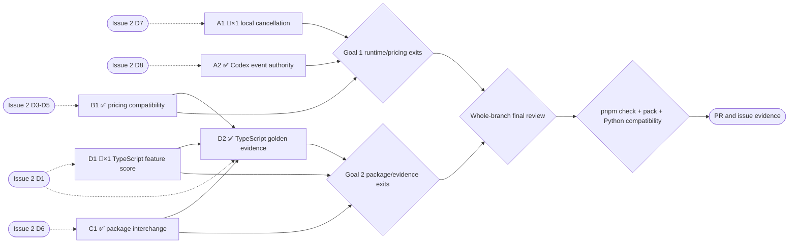

# Issue 2 compatibility completion — Goal-Driven Implementation Plan

Sources: https://github.com/tyxter-dev/blackbox-ts/issues/2 and user request 2026-09-08: “can you check on issue 2? let's finish it if possible”.
Written: 2026-09-08
Feature map: flat repository, 191 files at baseline; temporary scout output /tmp/blackbox-issue-2-feature-map.yml (0 apps, features, shared kernels). No generated scouting artifact will be committed.

## Premise corrections

- Issue 2 contains D1 and D3–D8; D2 is a separate Python-repository maintenance decision and stays outside this task.
- D7 reproduced on baseline through the real local provider and session facade: cancellation followed by completion of an in-flight fake model turn throws “cannot transition from cancelled to failed” (src/providers/local-agent.ts:193, src/runtime/agent-sessions.ts:264).
- D8 reproduced through the injected JSON-RPC fixture and real facade: wire `blackbox/approval/requested` projects an approval, but approving it throws unknown request and sends no response (src/providers/codex-app-server.ts:570, src/providers/codex-app-server.ts:778).
- The original issue's deferral does not itself authorize public changes; the user's later explicit request to finish those listed items supplies implementation authorization. Preserve existing native inputs and defaults; do not remove public APIs or expand this into a release.
- Pricing, package and parity mapper conclusions are integrated below before their sections dispatch; unknown details are not implementation facts.
- D5 premise correction: the pinned Python estimator treats an explicit reasoning rate as a supplemental charge in addition to output, not a replacement rate for a partition of output. Source: pinned Python repository, `src/blackbox/core/accounting.py`, line 108. Preserve this intentional meaning if implementing the optional rate; do not invent a subtractive formula.
- D1 mapper correction: an existing `Not supported yet` row is not evidence of an intentional scope decline. Keep `parent.local-tools.namespaced-toolref-ids` in the canonical inventory with its honest status unless a separate scoped reason is established. The initial migrated TypeScript denominator is 145 (144 existing feature requirements plus OpenRouter), with 26 supplements outside it. A separately recorded `declined` relation must not become a way to erase incomplete work.
- D6 mapper correction: actual pinned Python packages also carry structured version/metadata/publication, MCP objects and skill references. An explicit importer must validate the foreign schema. The issue chiefly describes Python→TypeScript ingress; reverse export is an optional scope question sent to the user while A1 proceeds.
- D4 mapper correction: the pinned parent has no price for canonical `xai:grok-4.20-0309-non-reasoning`, so its alias must still report missing pricing after alias resolution. Do not invent a price to satisfy the issue's overbroad example. Source: src/pricing/index.ts:218 and the pinned parent pricing-catalog test.

## 0. Execution contract

### Roles

Main orchestrates, reads/reviews, writes this plan, verifies, and commits. A single implementer writes each active section, without commits or delegation. Mappers and independent reviewers are read-only.

### Harness routing

Harness: codex. Direct pinned generic fallback because the spawn schema has no custom-role selector. Prior turns confirmed the implementer/reviewer scope and successful dispatch. Runtime model identity is not exposed.

| Role | Requested | Role-confirmed | Model/effort-confirmed | Fallback used |
| --- | --- | --- | --- | --- |
| Implementer | goal-implementer-terra / gpt-6-astra / low | generic implementation scope; attestation=none | explicit selector accepted in prior turns; runtime unknown | direct pinned generic |
| Mapper | goal-explorer / gpt-5.6-luna / max | three read-only scopes dispatched; attestation=none | explicit selector accepted; runtime unknown | direct pinned generic |
| Reviewer | goal-reviewer / gpt-5.6-terra / high | independent read-only scopes confirmed in prior turns; attestation=none | explicit selector accepted; runtime unknown | direct pinned generic |

### Global gate

```sh
pnpm check
pnpm pack --dry-run
```

Baseline result: source tree equals released 771d76e; prior release full check passed 292 tests with 5 network-gated skips, package install/exports/Echo and Linux/Windows CI passed. Fresh focused D7 and D8 probes above reproduce both defects on 2026-09-08; no full baseline repeat needed.
Final gate: orchestrator after independent final review. Optional Python compatibility suite runs once after fixture changes against the pinned checkout, using Python 3.11. No provider-network smoke required for these offline changes.

### Execution-environment preflight

Preflight status: known-baseline-red
Checked: 2026-09-08
Baseline SHA: 771d76e751cf67951049c046b91b11ae9d5f8c79
Execution realm: local repository and offline test doubles; GitHub only for issue/PR bookkeeping

| Capability | Probe / expected condition | Observed evidence | Classification |
| --- | --- | --- | --- |
| Worktree and branch | clean baseline, isolate issue work | clean main; created fix/issue-2-compatibility after fetch; origin/main is baseline | ready |
| Toolchain and routing | Node, pnpm, compiler and pinned routes | Node 24.20.0; pnpm 10.29.3; three mapper routes accepted; prior implementer/reviewer routes available | ready |
| Parent reference | read-only pinned checkout | /srv/projects/repos/blackbox HEAD d5be68e03ca7750920569578710a2ee25d25530c | ready |
| Host resources | writable build/temp outputs and free disk | source probes read dist; temporary fixture wrote successfully; 235 GiB available | ready |
| Infrastructure and secrets | no DB/server/paid API required | offline fixtures only; no credential values read | not-required |
| External authority | GitHub read and eventual PR/update | issue 2 read; user requests finishing it; no release requested | ready |
| Baseline defect | real library entrypoints reproduce | D7 terminal transition error; D8 spoofed approval unknown when answered | known-baseline-red |

#### Known blockers

| Condition | Detection | Pre-approved handling |
| --- | --- | --- |
| Windows Git fixture transient timeout/EBUSY | one CI job fails while same commit/platform passes elsewhere | inspect log and rerun failed job once; recurring failure requires diagnosis, never loosen tests blindly |
| npm package consumer uses Git-tracked source list | new source not staged before package check | stage accepted new source/examples before package smoke |
| Python fixture byte reproducibility | default interpreter differs from fixture baseline | use existing Python 3.11 interpreter; preserve frozen Python checkout |
| Plans excluded from Prettier intentionally | validator-exact tables conflict with formatting | keep plan under docs/plans; validate mechanically, no new ignore patterns |

### Expensive or mutating lifecycle gate budget

| Gate | Consumes / invalidated by | Planned runs (impl / orch) | Preflight | Actual runs | Why this count is safe |
| --- | --- | --- | --- | --- | --- |
| Focused regression suites | active section source/tests | 1 per section / 0; repeat affected tests on correction | proven by baseline toolchain and probes | A1: 3 failing reproductions and 3 passing iterations; final 43 tests. A2: 1 failing reproduction + 29 passing Codex tests + 43 shared-reader tests. B1: failing estimator/normalizer probes, 36 passing tests + 2 title-refinement tests; artifact checks passed. C1: 95 focused tests, actual Python ZIP generation and grant-removal sensitivity passed; affected API/typecheck/parity/lint/format checks passed. D1: old-floor probe and 3 golden reader failures, 39 initial tests, 35 corrected maintenance tests (scope review also ran 35); 6 unaffected golden tests retained; generator integrity probe and checks passed. D2: 168 tests across 9 suites; fixture drift and missing-crosswalk-entry rejection; native catalog additions admitted while changed/missing adopted rows fail; four Python samples reproduce in UTC and America/Los_Angeles; no-listener probe, typecheck, parity, lint and format pass | distinct regression paths, share evidence |
| Full pnpm check | final source/tests/scripts/artifacts/docs | 0 / 1 | proven at released baseline | 0 | after final review; includes clean package consumer |
| pnpm pack --dry-run | final package/source/docs | 0 / 1 | proven at released baseline | 0 | final publishable tarball without publishing |
| Full optional Python compatibility suite | fixtures/scripts and frozen checkout | 0 / 1 | proven in previous parity refresh with Python 3.11 | 0 (section fixture generation/probes recorded separately in focused evidence) | verify integrated compatibility mappings once at final candidate |
| Push and PR CI | reviewed branch and final gate evidence | 0 / 1 push, automatic push/PR CI | GitHub access proven | 0 | no merge/tag/publish implied by this task |

### Rulings

#### Floor rulings (the user owns these)

| # | Section | Decision | Options | Recommendation | Ruling |
| --- | --- | --- | --- | --- | --- |
| F1 | B1 | Listed pricing compatibility behavior and optional provenance/rate representation | additive compatibility versus changing existing required fields | additive optional fields; preserve existing defaults | authorized by user request to finish D3–D5, 2026-09-08 |
| F2 | C1 | Python package interchange | explicit conversion preserving native contracts versus silently changing native readers | explicit conversion, reject ambiguous/conflicting input | authorized implementation of D6 by user request; any removal or unsupported semantic expansion requires a new ruling |
| F3 | A2 | Forged private Codex wire methods | retain parent spoofing versus close authority boundary | distinguish trusted synthetic events from untrusted wire payloads | user request to fix D8 supersedes historical parent-identical deferral |
| F4 | all | Stable error codes | reuse existing typed errors | no new code strings unless separately ruled | reuse configuration_error, unsupported_feature, agent_runtime_error, existing pricing/session families |
| F5 | all | Terminal action | commit, push, PR linked to issue; no release | reviewable PR with issue evidence | commit/push/PR and issue progress authorized by task; merge/release is separate |

#### Recorded calls (orchestrator-ruled under the floor, user-vetoable)

| # | Section | Call | Rationale |
| --- | --- | --- | --- |
| R0 | all | ⇢ lane: full | six sections touch shared contracts, state transitions, fixtures and generated reports |
| R1 | all | ⇢ Finish all seven issue items; do not include OpenCode issue 4 or Python freeze issue 22 | independent scope; no reason to grow this change |
| R2 | A1 | ⇢ Cancellation remains terminal; preserve trailing raw run diagnostics without a second terminal transition | fixes lifecycle projection, no public status additions |
| R3 | A2 | ⇢ Private wire events are non-authoritative; genuine native approvals, cancel, failure and model events remain available | closes spoofing while preserving usable native paths and raw payloads |
| R4 | C1 | ⇢ Existing TypeScript permissions records and tool refs remain canonical; Python conversion is explicit and fails closed on ambiguous authority | backward-compatible boundary, no widening of grants |
| R5 | D1, D2 | ⇢ TypeScript owns feature score and golden expectations; Python evidence is frozen compatibility information, never a score floor | follows user's canonical-TypeScript direction and D1 scope |
| R6 | all | ⇢ Keep package version unchanged for this review branch; document Unreleased changes | no publication requested; avoid claiming an unreleased version is deployed |
| R7 | D1 | ⇢ One score: per-feature TypeScript status histogram, full Supported count divided by canonical feature count; conditional/partial/contract/unsupported reported separately | no arbitrary status weights or removal of unfinished features to raise a score; baseline 138 full / 145 total |
| R8 | C1 | ⇢ Explicit Python-to-TypeScript ZIP importer with documented limits; no reverse exporter in this issue | Issue D6 describes Python ingress. Optional scope question received no answer while independent work proceeded; recommended scope stated to user. Preserve execution options separately, reject unsupported behavior rather than silently discard it. |
| R9 | D1, D2 | ⇢ Preserve artifact paths unless a reader must change; migrate their ownership and schema, not merely their labels | TS status must be authored independently, new native rows need no Python counterpart, and frozen Python requirements receive explicit compatibility dispositions. A lower honest TS status is valid and must not fail a parent-rank floor. |
| R10 | C1 | ⇢ Optional importer options may supply `connector_auth` keyed by connector name; a foreign connector requires an explicit mechanism mapping | Python ConnectorSpec has kind/auth_mode, while TS requires auth. Preserve auth_mode, scopes and refs; do not invent auth='none'. This additive import configuration supplies missing descriptive information without adding credential handling or granting authority. |
| R11 | C1 | ⇢ Imported execution supports model-loop or local-agent routes; reject non-local agent selectors and unsupported foreign execution requirements explicitly | Only local agents consume the existing run_request channel with matching model-id semantics. Skill execution, MCP toolsets, scheduling and nonrepresentable memory/publication behavior require separate native contracts. This resolves D6 through a documented supported subset and typed rejection, as allowed by the issue. |
| R12 | D1, D2 | ⇢ Retain TypeScript-owned legacy IDs alongside Python-parsed requirement names/statuses in the existing baseline; adopted/unsupported mappings must keep that ID | Prevents accidental historical remapping while keeping native statuses/names independent. The baseline is also a regeneration input; restore its committed copy if missing. |

### Base drift policy

Fetch and merge origin/main before final review, preserving accepted commits. Do not rewrite pushed history. Reuse gate evidence only when consumed inputs remain unchanged.

### Rules

One implementer at a time; no unrelated changes. Use focused before/after evidence. Every added claim needs source anchors. Reviewers are independent and read-only; actual gates and explicit deferrals govern completion. User authorization persists; only genuinely unruled scope changes require clarification.

## 1. Goals — observable definition of done

### Goal 1 — Runtime and pricing compatibility

- [x] Cancelling a local session through run/stream returns and durably replays cancelled without terminal-transition errors; normal completion and real failure remain distinct.
- [x] Forged blackbox/* notifications cannot create approval or terminal authority; real approval/cancel/failure paths still work and raw wire evidence survives.
- [x] Combined cache usage, aliases and independent pricing/provenance fields behave as specified with existing callers preserved.

### Goal 2 — Package interchange and canonical evidence

- [x] Explicit Python/TypeScript package conversion handles grants, refs and execution configuration or rejects unsupported/ambiguous combinations before dispatch; native package round trips and restrictive boundaries remain correct.
- [x] One TypeScript-owned feature score includes native extensions; Python compatibility and explicitly declined adoption are reported separately without forcing TypeScript status to follow Python.
- [ ] TypeScript golden fixtures and TypeScript-first test crosswalk are authoritative; Python fixtures remain reproducible compatibility evidence. Documentation and issue checkboxes match verified behavior.

## 2. Topology graph and recommended order

### Topology graph



### Graph Findings

- D1 independent review found a stale current README score paragraph and a validator gap permitting rewritten legacy requirement IDs with unrelated adopted feature mappings. Main verified both; one correction round covers doc truth and frozen mapping integrity without constraining independent TypeScript status or native feature additions.

- Independent pre-inversion topology review required two plan-only corrections: express the external Python source as an external reference rather than an invalid local anchor, and explicitly include later R7/R9 rulings in section dispatch instructions. Main verified both findings and corrected all section ruling references before D1 dispatch. Independent re-review approved the corrected topology; plan and 33-anchor validation passed, with no product edits or repeated broad gates.

- Confirmed during A1: terminal-state readers include a stopped consumer and a recreated provider. Initial implementation missed their interaction; one reliability correction added a live-record check and focused before/after regressions. Extra focused runs came from this concrete reader-sweep finding, not duplicated broad gates.
- Structural/provenance classes: every D item reaches a section and goal. Only D2 joins three hard dependencies; those are independently tested before fixture assembly. No cycle or false long chain.
- Reader sweep: A1 touches terminal-state projection read by persistence/run/replay; A2 touches event authority read by facade approvals/terminal state; B1 touches pricing read by runtime estimates, model catalogs, golden normalizers and catalog snapshots; C1 touches grants and routing read by validation, lowering, serialization and package execution; D1/D2 touch inventory/fixtures read by every parity generator, test and current doc. Owning section must enumerate and verify exact readers before acceptance.
- Constraint/negative-space classes: A1 does not relax transitionAgentSession; A2 native approvals and cancellation must pass; C1 ambiguous grants fail closed and legitimate explicit grants are admitted. No auth/tenant/database migration, quota or production rollout.
- Data-path reachability: conversion must be exercised through public package entrypoints; scorer must consume the TypeScript status and sources, not only rename labels; golden fixtures must be replayed by real tests.
- Siblings: local completion/failure/cancel, Codex server requests/notifications/synthetic events, pricing aliases and rate fallbacks, package directory/ZIP/object paths, and all fixture directions are included in review.
- Lifecycle/environment: one final global gate after review; optional Python compatibility stays manual. Known Windows timeout recorded. No live provider keys or deploy environment needed.
- Scope/contracts: issue-specific additive behavior is authorized; removal of native APIs, new error codes, version release and unrelated parity gaps are excluded.
- Plan-as-evidence and evaluator soundness: validate anchors and plan; use reproduced D7/D8 paths and meaningful pricing/package/scorer counterexamples, not snapshot self-agreement alone.
- Accepted risk: pinned Python formats may express runtime behavior TypeScript cannot safely implement; conversion must reject those explicitly and any intentional decline needs an explicit disposition, not silent loss.
- At completion: record confirmed, absent and missed findings here.

### Corrections in force

- 2026-09-08 — baseline — D7/D8 reproduced through public runtime paths; permission restrictions are not required to reproduce D7.
- 2026-09-08 — mapping — package and parity reports validated with 40 and 63 anchors. Raw report paths /tmp/blackbox-issue2-packages-map.md and /tmp/blackbox-issue2-parity-map.md are temporary working evidence. Pricing mapping paused to prioritize A1; orchestrator independently verified the parent estimator and catalog alias writers. Do not accept the parity mapper's automatic omission of the unsupported feature from the score.
- 2026-09-08 — B1 mapping completed — /tmp/blackbox-issue2-pricing-map.md validated with 50 anchors. Preserve exact-first single-hop alias lookup, 36 canonical pricing rows, independent cached-input and read fields, supplemental reasoning cost, and source URLs already present on all pinned parent rows. The xAI alias cannot create a missing canonical price. Public/manual usage may supply a combined counter independently; provider extraction is not the only writer.
- 2026-09-08 — A1 correction — cancellation can precede invocation shutdown. A later consumer must drain unseen events only if the actual local provider still owns that live session. Internal WeakMap lookup avoids reconnecting remote or recreated providers; persisted terminal stream/replay remains available without a provider. Fresh-runtime run artifact lookup is a pre-existing limitation outside A1; no new public capability or durable schema was added.
- 2026-09-08 — A2 reader correction — changing forged private methods to log events alone is insufficient: the facade previously saved approval-shaped data from every event and accepted provider state from logs. Gate approval projection by APPROVAL_REQUESTED and exclude CLOUD_AGENT_LOG state projection, preserving raw diagnostics and genuine normalized authority. This enforces the existing log authority boundary without a new public event type.
- 2026-09-08 — B1 compatibility boundary — new rate types can represent independent source values, but bundled rows and Python-normalized compatibility snapshots retain their earlier effective read/creation fields. In particular, absent parent creation rates stay explicitly priced at ordinary input in those rows. Preserve this existing default and document that optional-field absence is not a serialization round-trip guarantee; custom entries use the new fallback order.
- 2026-09-08 — C1 schema audit — native lowerWorkspaceAgentSpec retains skill names only (src/workspace-agents/lowering.ts:22), while pinned Python execution passes/stages skill requirements. Native TS cron matches all fields (src/schedules/index.ts:48); pinned Python uses day-of-month OR day-of-week when both restricted, and accepts fractional/second intervals absent in TS. Explicit importer limits may reject foreign skills, schedules and unrepresentable MCP/memory/publication behavior; these are documented scope dispositions, never silent omissions or promises of temporary support. Preserve representable selectors, execution options, grants, connector bindings, identity and metadata. Native runtime redesign stays outside C1.
- 2026-09-08 — C1 execution audit — Codex forwards bare model ids and other injected agent adapters do not uniformly consume metadata.run_request; support imported model-loop/local routes only. Python hosted dataclass serialization can erase the type discriminator, so reject ambiguous hosted objects rather than infer their kind. Python's direct model path ignores spec.extra; returned TypeScript extra options intentionally use the TS model-request contract and must be described as an explicit translation, not universal execution parity. Import itself performs no execution.

- 2026-09-08 — D1 reader sweep — inventory pin migration includes the three existing golden consumers as well as maintenance scripts. Their fixture authority changes later in D2, but their schema readers must already work at D1. Declined Python-only evidence must traverse the crosswalk without invented TypeScript tests; status histogram accompanies the full/total score.

- 2026-09-08 — D1 review correction — preserve frozen legacy requirement identity and adopted-feature mapping in validation, not merely the current migrated values. An unrelated TypeScript feature must not satisfy an adopted Python requirement by changing its ID/link. This is traceability validation, not a Python status floor. The current README score paragraph must match the matrix at the D1 commit.

- 2026-09-08 — D2 lifecycle audit — canonical fixture generation loads current source using the existing dev-only Vite dependency, so no stale dist dependency or extra build is required. Installed Vite6 middleware mode with hmr:false can still create a WebSocket listener; explicitly disable server.ws and close the loader in finally. The no-listener preload probe verifies this offline CLI boundary. Test crosswalk enumeration matches Vitest filesystem pattern tests/**/*.test.ts, avoiding omission of new untracked tests.

- 2026-09-08 — D2 ownership audit — frozen Python catalog compatibility must preserve assertions for every adopted row while admitting additional TypeScript-native rows. Whole-list equality against Python would still make it the catalog authority after a directory rename. The canonical TS catalog snapshot/native tests cover full TS enumeration; changed or missing adopted compatibility rows still fail.

### Hard dependencies

D2 follows D1, B1 and C1 because final fixture ownership and compatibility evidence must reflect the final schema, pricing representation and package interchange.

### Soft dependencies

A1, A2, B1, C1 and D1 are sequential implementation preferences with independently useful outcomes, not hard prerequisites for each other.

### Recommended linear order

A1 → A2 → B1 → C1 → D1 → D2 → whole-branch review → global gates → PR and issue update.

## 3. Sections

## A1 — Local cancellation terminal state

GOAL:
Close issue 2 D7 with observable regression proof and truthful documentation.

SOURCES:
Issue 2 D7; user request 2026-09-08.

TARGET:
Flat repository; owning source/tests/scripts in context and their current docs, no external repository writes.

DEPENDS ON:
none.

IMPLEMENTER PROFILE:
goal-implementer-terra / gpt-6-astra / low via direct pinned generic fallback.

CONTEXT TO AGGREGATE:
src/providers/local-agent.ts:193; src/runtime/agent-sessions.ts:264; src/core/sessions.ts:85; tests/unit/agent-sessions.test.ts:38

WRITERS:
LocalAgentProvider.cancel/executeRun append terminal/run events; AgentSessionsRuntime.streamSession persists their projection.

SIBLING SURFACES:
Verify matching readers/writers listed in Graph Findings and the mapper report; unrelated provider features remain outside scope.

LIFECYCLE / GATE EFFECTS:
Produces source/tests/docs or generated evidence consumed by focused and final gates. Changes invalidate only matching source/fixture/doc inputs; no release, migration, service or secret produced.

IMPLEMENT:
Make local cancellation settle and replay as cancelled even when an in-flight invocation emits trailing RUN_FAILED or completion diagnostics. Keep strict core session transitions; normalize at the owning lifecycle boundary. Preserve raw events and prove normal success/failure still behave. Add deterministic run/stream cancellation and replay regressions, including cancellation during an outstanding model/approval where appropriate. Update current lifecycle documentation and Unreleased changelog; do not rewrite historical records.

CONTRACT DECISION — ESCALATE:
Apply recorded F1–F5 and R1–R12, including the section-specific calls. User requested these issue-specific compatibility fixes. Stop only for an unruled removal, new public error code, unsupported semantic expansion or irreversible action outside commit/push/PR/issue progress. Otherwise record the routine implementation choice and continue.

VERIFY:
pnpm exec vitest run tests/unit/agent-sessions.test.ts tests/unit/permission-spine.test.ts; pnpm typecheck. Use focused before/after evidence, including existing fresh D7/D8 probes. Reuse unaffected checks. Global gate stays after final review. Real library calls with offline transport are the relevant end-to-end client, not provider-network smoke.

REVIEW:
failure-mode/reliability, convention/scope, doc-truth.

ACCEPTANCE:
The corresponding Goal 1 or Goal 2 clause passes, with no silent data loss or capability overclaim and no unresolved in-scope finding.

COMMIT:
fix(runtime): preserve cancelled local session state (#2)

## A2 — Codex event authority

GOAL:
Close issue 2 D8 with observable regression proof and truthful documentation.

SOURCES:
Issue 2 D8; user request 2026-09-08.

TARGET:
Flat repository; owning source/tests/scripts in context and their current docs, no external repository writes.

DEPENDS ON:
none.

IMPLEMENTER PROFILE:
goal-implementer-terra / gpt-6-astra / low via direct pinned generic fallback.

CONTEXT TO AGGREGATE:
src/providers/codex-app-server.ts:570; src/providers/codex-app-server.ts:742; tests/golden/codex-app-server-events.test.ts:43; tests/unit/codex-agent-provider.test.ts:1

WRITERS:
CodexConnection.handleNotification consumes untrusted messages; handleServerRequest/cancel/fail create local synthetic events; coerceCodexEvent projects them.

SIBLING SURFACES:
Verify matching readers/writers listed in Graph Findings and the mapper report; unrelated provider features remain outside scope.

LIFECYCLE / GATE EFFECTS:
Produces source/tests/docs or generated evidence consumed by focused and final gates. Changes invalidate only matching source/fixture/doc inputs; no release, migration, service or secret produced.

IMPLEMENT:
Separate private synthesized blackbox/* authority from external wire methods without trusting a caller-supplied marker. Forged notifications remain non-authoritative with raw evidence preserved; native approved methods retain behavior. Cover each private session/approval method and genuine approval response/cancel/failure paths through injected transport and facade. Update normalization-table prose and generated divergence notes, regenerating affected crosswalk only. Preserve public transport types unless an additive change is demonstrably needed.

CONTRACT DECISION — ESCALATE:
Apply recorded F1–F5 and R1–R12, including the section-specific calls. User requested these issue-specific compatibility fixes. Stop only for an unruled removal, new public error code, unsupported semantic expansion or irreversible action outside commit/push/PR/issue progress. Otherwise record the routine implementation choice and continue.

VERIFY:
pnpm exec vitest run tests/unit/codex-agent-provider.test.ts tests/golden/codex-app-server-events.test.ts; pnpm typecheck; pnpm check:parity. Use focused before/after evidence, including existing fresh D7/D8 probes. Reuse unaffected checks. Global gate stays after final review. Real library calls with offline transport are the relevant end-to-end client, not provider-network smoke.

REVIEW:
security/authz, contract/API, failure-mode/reliability, convention/scope, doc-truth.

ACCEPTANCE:
The corresponding Goal 1 or Goal 2 clause passes, with no silent data loss or capability overclaim and no unresolved in-scope finding.

COMMIT:
fix(codex): distinguish synthetic authority from wire events (#2)

## B1 — Lossless pricing compatibility

GOAL:
Close issue 2 D3, D4, D5 with observable regression proof and truthful documentation.

SOURCES:
Issue 2 D3, D4, D5; user request 2026-09-08.

TARGET:
Flat repository; owning source/tests/scripts in context and their current docs, no external repository writes.

DEPENDS ON:
none.

IMPLEMENTER PROFILE:
goal-implementer-terra / gpt-6-astra / low via direct pinned generic fallback.

CONTEXT TO AGGREGATE:
src/pricing/index.ts:4; src/pricing/index.ts:37; src/pricing/index.ts:72; src/providers/catalog.ts:1; tests/compatibility/python-catalog.test.ts:1

WRITERS:
PricingCatalog.set/get/estimate and bundled pricing builders; catalog/fixture generators serialize rates and provenance; runtime consumes estimates.

SIBLING SURFACES:
Verify matching readers/writers listed in Graph Findings and the mapper report; unrelated provider features remain outside scope.

LIFECYCLE / GATE EFFECTS:
Produces source/tests/docs or generated evidence consumed by focused and final gates. Changes invalidate only matching source/fixture/doc inputs; no release, migration, service or secret produced.

IMPLEMENT:
Implement audited legacy-combined cache accounting, model-alias lookup and independent optional cached-input/reasoning-output rates plus source_url provenance. Preserve exact-key precedence, distinct source fields and existing defaults/row enumeration. An explicit reasoning rate is a supplemental charge as in the pinned Python estimator; document that output tokens remain charged at their ordinary rate and no reasoning charge is added when the optional rate is absent. Cover combined-only/mixed counters, distinct rate values, alias overrides/missing aliases, and lossless catalog normalization. Update public API/catalog snapshots with generators and current migration/parity notes; record parent-specific differences explicitly.

Mapped choices: add `PricingCatalog.registerModelAlias(provider, alias, model)` (a grouped helper is optional), seed bundled aliases from bundled provider models, and keep exact rows ahead of one-hop aliases. Add optional nested `cached_input_per_million` and `reasoning_output_per_million`, plus `PricingEntry.source_url`; optional estimate provenance may preserve that URL. Preserve the old effective cache-read field for compatibility while carrying raw cached-input separately in bundled rows and Python normalization. Use read→cached→input and creation→cached→input rate fallback orders. Do not add automatic runtime billing or new price rows.

CONTRACT DECISION — ESCALATE:
Apply recorded F1–F5 and R1–R12, including the section-specific calls. User requested these issue-specific compatibility fixes. Stop only for an unruled removal, new public error code, unsupported semantic expansion or irreversible action outside commit/push/PR/issue progress. Otherwise record the routine implementation choice and continue.

VERIFY:
pnpm exec vitest run tests/unit/planning-accounting-config.test.ts tests/unit/registry-catalog.test.ts tests/golden/python-catalog-differential.test.ts; pnpm typecheck; affected API/catalog/parity generator checks. Use focused before/after evidence, including existing fresh D7/D8 probes. Reuse unaffected checks. Global gate stays after final review. Real library calls with offline transport are the relevant end-to-end client, not provider-network smoke.

REVIEW:
contract/API, data/migration, failure-mode/reliability, convention/scope, doc-truth.

ACCEPTANCE:
The corresponding Goal 1 or Goal 2 clause passes, with no silent data loss or capability overclaim and no unresolved in-scope finding.

COMMIT:
fix(pricing): complete cache, alias and provenance compatibility (#2)

## C1 — Explicit portable-package interchange

GOAL:
Close issue 2 D6 with observable regression proof and truthful documentation.

SOURCES:
Issue 2 D6; user request 2026-09-08.

TARGET:
Flat repository; owning source/tests/scripts in context and their current docs, no external repository writes.

DEPENDS ON:
none.

IMPLEMENTER PROFILE:
goal-implementer-terra / gpt-6-astra / low via direct pinned generic fallback.

CONTEXT TO AGGREGATE:
src/workspace-agents/types.ts:72; src/workspace-agents/package.ts:33; src/workspace-agents/runtime.ts:42; docs/MIGRATION.md:39; tests/unit/workspace-agent-runtime.test.ts:1

WRITERS:
Package directory/ZIP writers and readers, manifest validation, grant compiler and runWorkspaceAgent routing/lowering; explicit translators add a new ingress.

SIBLING SURFACES:
Verify matching readers/writers listed in Graph Findings and the mapper report; unrelated provider features remain outside scope.

LIFECYCLE / GATE EFFECTS:
Produces source/tests/docs or generated evidence consumed by focused and final gates. Changes invalidate only matching source/fixture/doc inputs; no release, migration, service or secret produced.

IMPLEMENT:
Add explicit Python-format translation preserving the native TypeScript permissions record and grants field. Public entrypoint `importPythonWorkspaceAgentPackage(bytes: Uint8Array, options?)` returns `{ source: 'python', spec: WorkspaceAgentSpec, run_options: Omit<WorkspaceAgentRunOptions, 'input'> }`, with explicit exported result/options types; options may carry `connector_auth: Readonly<Record<string, WorkspaceAgentConnector['auth']>>` per R10. Use existing export conventions. Translate workspace tool/grant refs and connector refs consistently. Account for agent_provider, model_provider, hosted_tools and extra in the existing spec/run-options contracts without silently dropping execution configuration; reject ambiguous/conflicting authority before dispatch. Reject agent_id and other unrepresentable behavior with existing typed errors and document the precise limits. Preserve caller overrides under existing runtime permission enforcement. Validate real pinned Python ZIP ingress, including allowlist grants, and native TS package round trips. Reuse the existing ZIP safety boundary; do not autodetect foreign format in native readers. Reverse export and directory convenience ingress are not required for the issue's Python-written-package defect. Keep foreign runtime integrations explicit and documented; every unsupported semantic choice gets a concrete disposition.

CONTRACT DECISION — ESCALATE:
Apply recorded F1–F5 and R1–R12, including the section-specific calls. User requested these issue-specific compatibility fixes. Stop only for an unruled removal, new public error code, unsupported semantic expansion or irreversible action outside commit/push/PR/issue progress. Otherwise record the routine implementation choice and continue.

VERIFY:
pnpm exec vitest run tests/unit/workspace-agents.test.ts tests/unit/workspace-agent-runtime.test.ts tests/unit/tool-permissions.test.ts; pnpm typecheck; relevant Python package conversion probe. Use focused before/after evidence, including existing fresh D7/D8 probes. Reuse unaffected checks. Global gate stays after final review. Real library calls with offline transport are the relevant end-to-end client, not provider-network smoke.

REVIEW:
security/authz, contract/API, data/migration, failure-mode/reliability, convention/scope, doc-truth.

ACCEPTANCE:
The corresponding Goal 1 or Goal 2 clause passes, with no silent data loss or capability overclaim and no unresolved in-scope finding.

COMMIT:
feat(workspace-agents): add explicit Python package interchange (#2)

## D1 — TypeScript-owned feature score

GOAL:
Close issue 2 D1 with observable regression proof and truthful documentation.

SOURCES:
Issue 2 D1; user request 2026-09-08.

TARGET:
Flat repository; owning source/tests/scripts in context and their current docs, no external repository writes.

DEPENDS ON:
none.

IMPLEMENTER PROFILE:
goal-implementer-terra / gpt-6-astra / low via direct pinned generic fallback.

CONTEXT TO AGGREGATE:
scripts/update-parity-inventory.mjs:9; scripts/check-parity-inventory.mjs:7; scripts/generate-parity-matrix.mjs:6; docs/parity-inventory.json:1; tests/unit/parity-maintenance.test.ts:1

WRITERS:
Inventory normalization/evidence definitions and matrix/check scripts; current docs consume generated score summaries.

SIBLING SURFACES:
Verify matching readers/writers listed in Graph Findings and the mapper report; unrelated provider features remain outside scope.

LIFECYCLE / GATE EFFECTS:
Produces source/tests/docs or generated evidence consumed by focused and final gates. Changes invalidate only matching source/fixture/doc inputs; no release, migration, service or secret produced.

IMPLEMENT:
Migrate the internal inventory to a TypeScript-owned feature/status vocabulary and one score that includes TypeScript-native features such as OpenRouter. Preserve stable traceability of old feature IDs and frozen Python evidence. Move parent-only unsupported/declined adoption into explicit compatibility dispositions with reasons rather than omitted rows or a forced status floor. Keep supplements separate verification evidence, not denominator inflation. Retire excluded-extension score semantics and Python-first direction-lock claims. Update all schema readers/generators/tests and generated matrix; prove valid TS-only features work while missing evidence/unknown statuses/undispositioned Python requirements fail.

CONTRACT DECISION — ESCALATE:
Apply recorded F1–F5 and R1–R12, including the section-specific calls. User requested these issue-specific compatibility fixes. Stop only for an unruled removal, new public error code, unsupported semantic expansion or irreversible action outside commit/push/PR/issue progress. Otherwise record the routine implementation choice and continue.

VERIFY:
pnpm check:parity; pnpm exec vitest run tests/unit/parity-maintenance.test.ts; generator determinism checks. Use focused before/after evidence, including existing fresh D7/D8 probes. Reuse unaffected checks. Global gate stays after final review. Real library calls with offline transport are the relevant end-to-end client, not provider-network smoke.

REVIEW:
data/migration, convention/scope, doc-truth.

ACCEPTANCE:
The corresponding Goal 1 or Goal 2 clause passes, with no silent data loss or capability overclaim and no unresolved in-scope finding.

COMMIT:
refactor(parity): make feature scoring TypeScript-owned (#2)

## D2 — TypeScript golden fixtures and test crosswalk

GOAL:
Close issue 2 D1 with observable regression proof and truthful documentation.

SOURCES:
Issue 2 D1; user request 2026-09-08.

TARGET:
Flat repository; owning source/tests/scripts in context and their current docs, no external repository writes.

DEPENDS ON:
D1, B1, C1.

IMPLEMENTER PROFILE:
goal-implementer-terra / gpt-6-astra / low via direct pinned generic fallback.

CONTEXT TO AGGREGATE:
scripts/generate-typescript-fixtures.mjs:1; scripts/generate-python-fixtures.mjs:1; scripts/generate-test-crosswalk.mjs:1; tests/golden/core-contracts.test.ts:1; docs/PARITY_MAINTENANCE.md:1

WRITERS:
TypeScript and Python fixture generators, crosswalk generator, golden tests, check scripts and package scripts; documentation and historical deferral status reference these outputs.

SIBLING SURFACES:
Verify matching readers/writers listed in Graph Findings and the mapper report; unrelated provider features remain outside scope.

LIFECYCLE / GATE EFFECTS:
Produces source/tests/docs or generated evidence consumed by focused and final gates. Changes invalidate only matching source/fixture/doc inputs; no release, migration, service or secret produced.

IMPLEMENT:
Complete D1 fixture-goldenness and crosswalk inversion: TypeScript-generated canonical expectations are checked offline and replayed through public contracts; enumerate TS tests first with Python compatibility mappings and explicit N/A reasons. Keep frozen Python fixtures as compatibility samples, not canonical score or source truth. Preserve checks that regenerated Python baseline samples match the pinned checkout. Include final pricing and package interchange proof. Retire obsolete reverse/parent-authoritative names and duplicate artifacts where no compatibility reader needs them. Consolidate current parity docs/index/feature claims, mark prior-plan D1/D3–D8 deferrals resolved with evidence, preserve dated history, and prepare precise issue/PR checklist evidence.

CONTRACT DECISION — ESCALATE:
Apply recorded F1–F5 and R1–R12, including the section-specific calls. User requested these issue-specific compatibility fixes. Stop only for an unruled removal, new public error code, unsupported semantic expansion or irreversible action outside commit/push/PR/issue progress. Otherwise record the routine implementation choice and continue.

VERIFY:
pnpm check:parity; affected golden/unit suites; pnpm typecheck; final whole-branch pnpm check and pack; optional pinned Python suite after review. Use focused before/after evidence, including existing fresh D7/D8 probes. Reuse unaffected checks. Global gate stays after final review. Real library calls with offline transport are the relevant end-to-end client, not provider-network smoke.

REVIEW:
data/migration, failure-mode/reliability, convention/scope, doc-truth.

ACCEPTANCE:
The corresponding Goal 1 or Goal 2 clause passes, with no silent data loss or capability overclaim and no unresolved in-scope finding.

COMMIT:
test(parity): make TypeScript fixtures and crosswalk canonical (#2)

## 4. Main-session acceptance protocol

Read the complete diff and claim anchors; verify actual tests, no unauthorized floor crossing, measurable acceptance, exact scope, conventions and tracked deferrals. Reuse valid evidence. Independent reviews must converge; send concrete findings to the same implementer. Record each rejection round and refute incorrect findings with code/probe evidence. Stage accepted source and ledger together, then commit.

## 5. Progress ledger

- [x] A1 Local cancellation terminal state — Goal 1 cancellation exit passed — accepted 2026-09-08 42accc6 — rounds: 1 — review: independent — routing: requested=Astra low / Terra high; role=generic; runtime=unknown; attestation=none — cost: unavailable / 1 implementer and 3 reviewers — env-retries: 0
  - R1 reliability: cancelled durable snapshots short-circuit later stream consumption after an early consumer stop; preserve access to unseen trailing diagnostics without weakening terminal state or reopening unrelated provider sessions. Validated review /tmp/blackbox-issue2-A1-reliability.md; doc-truth and scope approved the initial diff.
  - Evidence: 43 focused session/permission tests, typecheck, focused lint and API snapshot passed. Original 4 transition failures, resumed-consumer failure and 2 recreated-runtime failures observed before their corresponding fixes. Three independent lenses approved final six-file diff; main read full diff, verified sibling sweep and reports, all seven acceptance checks passed. Full gates remain scheduled.
- [x] A2 Codex event authority — Goal 1 authority exit passed — accepted 2026-09-08 2c1bb8a — rounds: 0 — review: independent — routing: requested=Astra low / Terra high; role=generic; runtime=unknown; attestation=none — cost: unavailable / 1 implementer and 3 reviewers across 5 lenses — env-retries: 0
  - Evidence: four forged-method failures observed before correction; 29 Codex/golden tests and 43 affected shared-reader tests passed, plus typecheck, parity, lint and formatting. Security, contract, reliability, scope and doc-truth approved; main read complete eight-file diff, verified authority reader/writer sweep and all seven acceptance checks. Public transport and durable schemas unchanged. Full gates remain scheduled.
- [x] B1 Lossless pricing compatibility — Goal 1 pricing exit passed — accepted 2026-09-08 27f122e — rounds: 0 — review: independent — routing: requested=Astra low / Terra high; role=generic; runtime=unknown; attestation=none — cost: unavailable / 1 implementer and 3 reviewers across 5 lenses — env-retries: 0
  - Evidence: 36 focused tests passed after observed estimator failures and normalizer field-loss reproduction; 2 golden tests rerun after title refinement. Typecheck/API/catalog/parity/lint/format and pinned Python fixture regeneration/check passed. Main recursively compared both catalog artifacts to 2c1bb8a: all existing fields/order/counts unchanged; each adds exactly 36 URLs and 15 cached rates. Five independent lenses approved; full ten-file diff, sibling sweep and all seven acceptance checks verified. No new rates or runtime billing; optional-absence/default limits documented.
- [x] C1 Explicit portable-package interchange — Goal 2 package exit passed — accepted 2026-09-08 e27c25e — rounds: 0 — review: independent — routing: requested=Astra low / Terra high; role=generic; runtime=unknown; attestation=none — cost: unavailable / 1 implementer and 3 reviewers across 6 lenses — env-retries: 0
  - Evidence: 95 focused tests, typecheck/API/parity/lint/format passed. Three actual pinned-Python ZIPs exercise explicit ingress and supported model/local consumers; grant-removal sensitivity failed both admitted-read assertions and restored tests passed. Six independent lenses approved; main read full source/test/docs/generator diff, validated reports, reviewed all seven acceptance checks and confirmed native readers/writers remain unchanged. Unsupported foreign execution semantics have documented scoped dispositions. Integrated fixture regeneration and final gates remain assigned to D2/final review.
- [x] D1 TypeScript-owned feature score — Goal 2 score exit passed — accepted 2026-09-08 44b74fb — rounds: 1 — review: independent — routing: requested=Astra low / Terra high; role=generic; runtime=unknown; attestation=none — cost: unavailable / 1 implementer and 3 reviewers — env-retries: 0
  - R1 traceability: reject rewritten frozen legacy IDs and redirected adopted mappings; correct root README score. Initial validated reviews preserved in /tmp/blackbox-issue2-D1-data-r1.md and /tmp/blackbox-issue2-D1-doc-r1.md. Both new tests failed before correction; corrected mutation now fails validation.
  - Evidence: 35 corrected maintenance tests plus 6 unaffected golden tests, parity, deterministic regeneration, affected fixture/catalog/drift readers, formatting and lint pass. Main compared all 170 legacy IDs/evidence bindings (preserved), two deliberate TS display-name changes and frozen baseline fields (unchanged except added requirements/ID provenance). Three independent lenses approved final diff; main completed reader/claim/retirement sweep and all seven acceptance checks. Native features and lower honest statuses remain admitted; full gates and fixture/crosswalk inversion remain scheduled.
- [x] D2 TypeScript golden fixtures and test crosswalk — Goal 2 fixture/crosswalk behavior passed; external issue bookkeeping follows final gates — accepted 2026-09-08 in this commit — rounds: 0 — review: independent — routing: requested=Astra low / Terra high; role=generic; runtime=unknown; attestation=none — cost: unavailable / 1 implementer and 3 reviewers across 4 lenses — env-retries: 0
  - Evidence: 168 focused tests across 9 suites; current-source native fixture check, all 33 executable TypeScript tests, 118 frozen Python module dispositions and 145 feature rows validated. Four Python samples reproduce in two timezones; no-listener probe and 683 local documentation targets pass. Main read full diff and validated implementation/reviewer reports and all seven acceptance checks. Data, reliability, scope and doc-truth approved. Full gates remain scheduled.

## Completion

- [x] Every section committed with reviewed evidence and ledger.
- [ ] Re-baselined on current origin/main before independent whole-branch final review.
- [ ] Whole-branch seams, contracts, claim decay, reader sweep and debris review clean.
- [ ] Goals and global/optional compatibility gates pass on final reviewed candidate.
- [ ] Gate budget actual runs and Graph Findings updated; temporary artifacts retired.
- [ ] Issue 2 checklist and PR accurately reflect completed behavior, with any residual explicit disposition.
- [ ] Graph/ledger validation and routing evidence complete; token counts reported if available.

## Deferrals

None newly accepted. D2 (Python repository freeze/archive) and OpenCode issue 4 are outside issue 2, not silently bundled into this task. Any newly discovered in-scope work must be completed or explicitly tracked with a machine-checkable re-entry gate before final acceptance.
