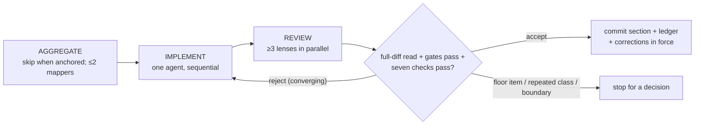
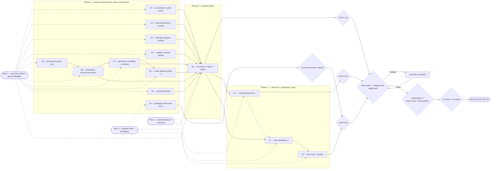

# blackbox-ts 0.2 parity refresh, canonical flip, and packaging — Goal-Driven Implementation Plan

Sources: user request 2026-09-05 — (1) "do another parity plan to update our app from the python lib", (2) "make blackbox-ts canonical", (3) "organize the repo and update the packaging if possible, it's in bad shape". Parent delta: tyxter-dev/blackbox `f27decbc` → `d5be68e0` (22 commits, releases 0.1.1 + 0.2.0).
Written: 2026-09-05
Feature map: docs/plans/parity-refresh-feature-map.yml — flat repository (0 apps / 0 features / 0 shared kernels, 178 files)

## Premise corrections

- "24 subpath exports" (orchestrator's initial read) — the exports map has **26** subpaths (package.json:19-124).
- Catalog delta initially inferred as 19→22 models — verified by importing the parent catalog at `d5be68e`: bundled models **19 → 29**, bundled pricing rows **21 → 36**.
- AGENTS.md is not a reliable instruction file for this plan: it declares the agent loop, durable memory, workspaces, and billing out of scope (AGENTS.md:9-10, AGENTS.md:30-31) while all shipped (src/runtime/agent-loop.ts:71, src/persistence/index.ts:1-3, src/workspaces/index.ts:1-6, src/pricing/index.ts:106). Sections follow the tree, not AGENTS.md; C3 repairs it.
- Local baseline is red for an environment reason, not a product defect at the pinned behavior: npm 12.0.2's `pack --json` emits an object keyed by package name; scripts/package-smoke.mjs:35-38 indexes `report[0]` and throws `npm pack produced no report`. CI (npm 10/11) is green (release run 33983963862 passed `pnpm check`). A0 fixes this first.
- The parent CHANGELOG's 0.1.1 text says Codex SDK `0.144.4`; the code pins `0.147.0` (parent `pyproject.toml` L46 and `providers/agent_adapters/codex.py` L35). The code is authoritative.

Out of scope (named so every input clause is dispositioned): physical file-tree restructuring (moving src/ or tests/ directories) — the parity inventory pins 177 repo paths and scripts/lib/parity-evidence.mjs hard-codes 142 of them, so a move is pure churn against the evidence registry; "organize the repo" is served by C2 (packaging), C3 (docs truth), and A0 (portable gates). Release/tag cutting stays a user action (F6/R5).

## 0. Execution contract

### Roles

- Main session: orchestrator and reviewer. It plans, dispatches, verifies, updates this ledger, and commits. It never edits product source or product docs.
- Section implementer: exactly one at a time; writes only inside its active section; never commits; never delegates writing.
- Mappers and reviewers: read-only; run in parallel within the harness thread cap.

### Harness routing

Harness: `claude` — see `references/routing-claude.md`.

| Role        | Requested                       | Role-confirmed              | Model/effort-confirmed | Fallback used                                       |
| ----------- | ------------------------------- | --------------------------- | ---------------------- | --------------------------------------------------- |
| Implementer | `gdi-implementer / opus / high` | not resolvable this session | via fallback           | `general-purpose+opus` (defs installed mid-session) |
| Mapper      | `gdi-mapper / sonnet / medium`  | not resolvable this session | via fallback           | `Explore` (3 PLAN-mode mappers ran and validated)   |
| Reviewer    | `gdi-reviewer / opus / high`    | not resolvable this session | via fallback           | `general-purpose+opus` per call                     |

`gdi-*` definitions were installed to `~/.claude/agents/` during preflight; they load only in a new session, so this session uses the documented fallbacks. Every ledger row records `fallback: general-purpose+opus` where used.

Session 2 (2026-09-06, resumed at A4): the `gdi-implementer`, `gdi-mapper`, `gdi-reviewer`, and `gdi-convention-reviewer` types resolve in the harness agent list, so from A4 onward every role is `requested = confirmed` (model/effort from the definition frontmatter); ledger rows from A4 record `routing: requested=gdi-*; confirmed`. The A4 implementer dispatched in session 1 was lost with the session (its diff survived uncommitted; its report did not) — per the lost-agent rule a new implementer resumed A4 from the surviving diff, recorded on the A4 ledger row.

### Global gate

```bash
pnpm check && pnpm parity:python -- --parent /srv/projects/repos/blackbox
```

Baseline result: 2026-09-05, HEAD `f7286fa`, `pnpm check` red at the final sub-gate only — `test:package` fails under local npm 12.0.2 (`npm pack produced no report`, scripts/package-smoke.mjs:38); all prior sub-gates (format, check:parity, typecheck ×2, check:api, lint, vitest) passed in the same run. CI at the same tree is green (release run 33983963862). Classified `known-baseline-red` with cause identified; A0 turns it green locally.
Final gate: after final review on the merged tree, run once by the orchestrator; CI 4-cell matrix runs on push as the independent confirmation.

### Execution-environment preflight

Preflight status: known-baseline-red
Checked: 2026-09-05
Baseline SHA: f7286fab06589adc0520cce7746ec592af8b590c (origin/main, clean tree; untracked docs/plans/ plan artifacts excluded)
Execution realm: local Linux host, direct pnpm/node/python

| Capability | Probe / expected condition | Observed evidence | Classification |
| -------------------------------- | ----------------------------------------------- | --------------------------------------------------------------------------------- | ------------------ |
| Worktree and branch              | blackbox-ts clean on main at origin/main        | `git status` clean except untracked docs/plans/; HEAD == origin/main == f7286fa   | ready              |
| Toolchain and agent routing      | node, pnpm, python3 present; roles resolved     | node v24.20.0, pnpm 10.29.3, python 3.13.5, npm 12.0.2; gdi-\* fallback per table | ready (fallbacks)  |
| Required infrastructure          | parent checkout reachable and at bump candidate | /srv/projects/repos/blackbox at d5be68e == origin/master (fetched this session)   | ready              |
| Credentials / external authority | none needed offline; smoke tests env-gated      | .env present and gitignored; not consumed by any planned gate                     | not-required       |
| Host resources                   | repo writable, disk adequate                    | builds and pnpm check ran to completion in-session                                | ready              |
| Running stack freshness          | no long-running stack involved (library)        | n/a                                                                               | not-required       |
| Baseline gate                    | focused baseline observed                       | `pnpm check` red only at package-smoke under npm 12 (see Global gate)             | known-baseline-red |

#### Known blockers

| Condition | Detection | Pre-approved handling |
| -------------------------------------------------------------------- | ---------------------------------------------------------- | ----------------------------------------------------------------------------------------------------------------------------------- |
| npm 12 `pack --json` object-shaped report breaks package-smoke       | `test:package` throws `npm pack produced no report`        | A0 fixes the parser for both shapes; until A0 is accepted, treat this exact failure as environmental (`⚙`), not a section defect    |
| Python 3.13 local vs 3.11 CI byte-parity of regenerated fixtures     | `parity:python` byte-compare fails only in one environment | Regenerate under Python 3.11 via `uv run --python 3.11` in the parent checkout (parent ships uv.lock); record which python was used |
| Parent-pin HEAD guards reject any parity script run at the wrong pin | `Parent checkout is <head>; expected pinned commit …`      | Before B1: do not run `parity:python`/generators. From B1 on: parent checkout stays at d5be68e (already there)                      |
| prettier's `format:check` globs docs/plans/ (until A0 lands the ignore entry)                          | `pnpm format:check` warns on plan artifacts                | Orchestrator runs `pnpm exec prettier --write docs/plans/` after each plan edit; plan files are committed with sections             |

### Expensive or mutating lifecycle gate budget

| Gate                                                                             | Consumes / invalidated by                                    | Planned runs (impl / orch) | Preflight                                                               | Actual runs | Why this count is safe                                                                                                                                   |
| -------------------------------------------------------------------------------- | ------------------------------------------------------------ | -------------------------: | ----------------------------------------------------------------------- | ----------: | -------------------------------------------------------------------------------------------------------------------------------------------------------- |
| Consumer install+import smoke (`pnpm test:package`) — cheapest real-client probe | package.json files/exports, dist, docs presence              |                      2 / 1 | proven (runs inside pnpm check; red only for the npm-12 parse A0 fixes) |             | runs at A0 (green proof), C2 (new tarball shape), final; it is the library's "one real client interaction"                                               |
| Full `pnpm check`                                                                | any source/test/doc/config change                            |                      2 / 2 | proven                                                                  |             | focused suites per section; full runs at A0 (local-green proof), B1 (all-goldens-green point), final ×2 (pre/post final review only if corrections land) |
| `pnpm parity:python -- --parent /srv/projects/repos/blackbox`                    | pin, fixtures, TS build, parent checkout ref, python version |                      1 / 1 | unproven (not runnable at old pin without regen; guards verified)       |             | first run inside B1 (implementer), once more by orchestrator at final gate                                                                               |
| CI 4-cell matrix (ubuntu/windows × node 20.11/22)                                | pushed branch                                                |                      0 / 1 | proven (green on main)                                                  |             | runs once on push of the branch/PR (terminal action F6)                                                                                                  |
| Release publish                                                                  | tag                                                          |                      0 / 0 | proven this session                                                     |             | out of scope — user cuts releases separately                                                                                                             |

### Rulings

#### Floor rulings (the user owns these)

| #   | Section | Decision                                                              | Options                                                                                                                                                                                                                                                                                                                                                                             | Recommendation                                                                                                                                                                                                                                      | Ruling  |
| --- | ------- | --------------------------------------------------------------------- | ----------------------------------------------------------------------------------------------------------------------------------------------------------------------------------------------------------------------------------------------------------------------------------------------------------------------------------------------------------------------------------- | --------------------------------------------------------------------------------------------------------------------------------------------------------------------------------------------------------------------------------------------------- | ------- |
| F1  | `C2 ⚠`  | Published tarball contents (what `npm install blackbox-ts` delivers)  | (a) lean: dist JS+d.ts, README/CHANGELOG/FEATURES/LICENSE, examples; drop docs/ parity artifacts and all sourcemaps; README parity links point at GitHub. (b) keep current 1.8 MB shape. (c) drop only sourcemaps, keep docs/.                                                                                                                                                      | (a) — 67 % of the tarball is a generated 399 kB matrix whose links are all dead in the tarball, plus sourcemaps that cannot resolve (`sources: ../src`, src never packed); docs/ globbing also leaked an untracked local file into the last publish | ruled 2026-09-05: a |
| F2  | `C2 ⚠`  | Package identity                                                      | (a) keep `blackbox-ts` (published, OIDC trusted publisher already linked). (b) rename to `@tyxter/blackbox-ts` alongside `@tyxter/sdk-js`, deprecate `blackbox-ts`.                                                                                                                                                                                                                 | (a) — two alpha versions, near-zero adoption risk either way, but renaming re-runs the entire publish bootstrap (manual first publish + new trusted-publisher link) for cosmetic gain                                                               | ruled 2026-09-05: a (default, not vetoed) |
| F3  | `C1 ⚠`  | What the release and drift gates verify once blackbox-ts is canonical | (a) release fully independent: delete the parent checkout + `parity:python` from release.yml, keep offline checks; drop the CI python-parity job too. (b) release independent, CI keeps the pinned python-parity job as a blocking sync-honesty check; weekly drift job becomes informational (drop `--fail-on-drift`). (c) keep everything as today (Python still gates releases). | (b) — releasing must not depend on the frozen Python repo, but the CI job is cheap and keeps the committed fixtures honest against the pin they claim; drift becomes information about the downstream, not an alarm                                 | ruled 2026-09-05: a — FULLY independent (stronger than recommendation): parent checkout + parity:python removed from release.yml AND ci.yml; parity-drift.yml workflow removed; offline checks stay in pnpm check; local parity scripts remain for manual use; the global gate still runs parity:python once at plan completion to prove the sync claim |
| F4  | `A8 ⚠`  | Codex agent provider scope in TS                                      | (a) contract port: `CodexAgentProvider` with injected-client protocol, full event-normalization table, subscription-only guard, approval pause, artifacts — no child-process/SDK runtime (keeps the zero-runtime-deps rule); parent status stays honestly `Partial`. (b) skip entirely; record as a declined parent-only feature.                                                   | (a) — matches how ClaudeCode/OpenAICloud are already ported (src/providers/cloud-agents.ts:75-127) and keeps the catalog row truthful                                                                                                               | ruled 2026-09-05: a |
| F5  | all     | New stable `error.code`s this plan may add                            | none — reuse the existing typed error families in src/core/errors.ts (UnsupportedFeatureError, ConfigurationError equivalents); the permission denial reuses the existing policy-denial result shape                                                                                                                                                                                | none — reuse                                                                                                                                                                                                                                        | ruled 2026-09-05: none (default, not vetoed) |
| F6  | all     | Terminal external action                                              | (a) branch `parity-0.2` + push + PR (CI matrix runs pre-merge; user merges). (b) commit directly to main + push. (c) stop at local commits.                                                                                                                                                                                                                                         | (a) — 13 sections deserve the 4-cell matrix before main; no release tag in this plan either way                                                                                                                                                     | ruled 2026-09-05: a — branch parity-0.2, push, PR |

#### Recorded calls (orchestrator-ruled under the floor, user-vetoable)

| #   | Section | Call                                                                                                                                                                                                                                                                                                                                                                                                               | Rationale                                                                                                                                                                                          |
| --- | ------- | ------------------------------------------------------------------------------------------------------------------------------------------------------------------------------------------------------------------------------------------------------------------------------------------------------------------------------------------------------------------------------------------------------------------ | -------------------------------------------------------------------------------------------------------------------------------------------------------------------------------------------------- |
| R0  | all     | `lane: full`                                                                                                                                                                                                                                                                                                                                                                                                       | 13 sections, shared registries (parity inventory, exports map, catalogs), floor items — bounded lane ineligible on every check                                                                     |
| R1  | A5      | Permission boundary context uses `AsyncLocalStorage` from `node:async_hooks` (built-in, zero-dep), mirroring Python `ContextVar` semantics; generator re-entry wraps each `next()`/`return()` the way the parent wraps `anext`/`aclose`                                                                                                                                                                            | The only stdlib mechanism with `await`-surviving context; satisfies the no-runtime-deps rule; parent's local-provider re-entry pattern exists precisely because generator suspension leaks context |
| R2  | A5/A6/A7 | Negative space for the permission-grant enforcement (A5/A6/A7): default `permission_mode: "inherit"` changes nothing; with no active boundary all tools remain exposed; discovery meta-tools (`search_tools`/`load_tools`) stay reachable inside a boundary; the finalizer-tool exemption is preserved; empty grants deny tools but the loop still receives a tool runtime; approvals already granted complete their dispatch | Mirrors the parent semantics exactly — the parent implementation is the ruling; enumerated so reviewers can check each path                                                                        |
| R3  | B1      | The inventory keeps its schema this plan; canonicality is expressed by (i) relaxing the direction lock to allow TS status ≥ parent status and (ii) gate/doc reorientation (C1) — the full scoring inversion (crosswalk direction, fixture goldenness, extension→exclusion semantics) is deferred with a tracking issue                                                                                             | Proportionate: the full inversion is a project of its own (7 structural inversions per the parity map); nothing user-visible depends on it today                                                   |
| R4  | B1      | `scripts/catalog-snapshot.mjs` stops hardcoding the parent SHA and reads it from docs/parity-inventory.json                                                                                                                                                                                                                                                                                                        | Removes the one unenforced pin copy the documented bump procedure misses (scripts/catalog-snapshot.mjs:12; gap in docs/PARITY_MAINTENANCE.md:63-66)                                                |
| R5  | C3      | package.json version moves to `0.2.0-alpha.0` with a CHANGELOG entry; no tag is pushed                                                                                                                                                                                                                                                                                                                             | Mirrors the parent 0.2.0 line; releasing stays a user action                                                                                                                                       |
| R6  | A9      | TS MCP `clientInfo`/server version strings move to `0.2.0` but keep the name `blackbox-ts` (parent uses `blackbox`)                                                                                                                                                                                                                                                                                                | The name identifies the implementation to MCP peers; diverging from the parent name is deliberate and documented in the crosswalk notes                                                            |
| R7  | A2      | Responses cache control: accept the parent's `cache.ttl` field name (wins when both present) while keeping the existing `cache.retention` as a legacy alias; `TurnRequest.cache` stays untyped | Parent-faithful naming (parent reads `ttl`); the TS `retention` name is drift with zero test coverage; accepting both is additive and keeps old callers working |
| R8  | A2      | Parent control cases relying on `extra_body` model/effort overrides are honestly N/A in TS: `mergeExtra` throws `ConfigurationError` on any collision with a normalized field, so no effective-model resolution exists — keep that contract, validate the typed surface only, and record each N/A parent case in the section report for B1's crosswalk notes | The TS collision contract is stricter and safer than silently resolving overrides; changing it would be a real public-contract change no ruling asked for |
| R9  | A2      | Per-model effort gating must add no new rejection for models the parent does not reject: `grok-4.6` gains its exact table, other xAI/OpenAI models keep today's advertised behavior (no blanket `conditional` conversion) | TS `assertCapabilitySupported` hard-rejects `conditional`, unlike parent semantics; blanket conversion would break currently-working requests |
| R10 | A5/A7   | TS `WorkspaceAgentValidationIssue` keeps its existing 3-field `{path, message, code}` shape; the parent's severity-first 4-field `ValidationIssue` is NOT mirrored — the new `invalid_permission_grants` code lands in the existing shape | Adding a severity field breaks a snapshotted public symbol for zero behavioral gain; every current TS issue is error-severity by construction |
| R11 | A6/A7   | The A6 enforcement spine includes the realtime dispatch path (`src/runtime/realtime-runtime.ts` ToolRuntime construction and `.call` site) — a second independent dispatch entry the section list omitted; and A7 creates the minimal `runWorkspaceAgent` bridge (compile grants → fail-before-side-effect preflight → boundary-wrapped run through the runtime facade), which has no TS counterpart today, so feature 144 can be honestly evidenced at B1 | Omitting realtime silently widens grants through a bypass; without a run bridge feature 144 cannot carry TS evidence and the inventory cannot classify it |
| R12 | A3      | Replay provenance ports with TS-consistent semantics: the digest covers the post-merge body [system, tools, native_history] and message_count = native_history length, using TS's existing assistant-only native_history composition — native_history is NOT changed to carry full history (a serialized provider-state contract change no ruling asked for). The guard property (unchanged system/tools/prefix on replay) holds identically; digests differ from Python by construction. Parent's conditional tool_choice status stays supported in the profile with the fable-5-1 forced-choice rejection enforced in the body validator (conditional is fatal in TS); temperature/top_p nondefault rejection enforced in the body validator, not via numeric supported_values (TS supported_values is string[]). The stableJson digest helper is duplicated locally in the anthropic module (~10 lines, mcp sibling referenced) rather than exported cross-module | Self-consistent TS guard preserves the parent contract without a state-shape break; the differential projection never reads tool_state so cross-language fixtures are unaffected; recorded for B1 crosswalk |
| R13 | A3      | AMENDED after review probes: the Opus-5 WebFetch rejection is NOT vacuous — raw-passthrough hosted tools and extra.tools dispatch web_fetch payloads to opus-5 where the parent rejects — so the parent's final-tools scan IS ported (body.tools type startswith web_fetch on claude-opus-5). text_editor version pinning remains skipped (no TS text_editor mapping — vacuity verified). The web_search version heuristic ported as originally ruled | Review probes (security + failure-mode lenses) showed two live bypass paths the typed-surface vacuity argument missed |
| R14 | A8      | Codex client is a NEW raw-boundary `CodexAppServerClient` interface (raw app-server notifications in; the provider owns the normalization table) — not the normalized `InjectedCloudAgentClient` shape. `AgentSpec` gains optional parent-mirroring fields (`environment`, `tools`, `hosted_tools`, `mcp_servers`) and `TaskSpec` gains (`model`, `workspace`) — additive, snapshot regenerated — so the subscription-only guard and unmapped-surface rejections have real fields to read. `'file_change'` joins the enumerated ArtifactType union (already type-legal via the open union). NO new compat module: aliases land via `ProviderRegistry.registerAgentProvider(provider, ['codex-app-server','codex_app_server'])` with an alias test copying the model-provider pattern; the parent's register_default_agent_providers/include-normalization convenience has no TS counterpart and stays a recorded divergence for B1 | The normalized injected-client shape leaves nothing to normalize (the F4 contract port IS the table); optional parent-mirroring fields are additive parity the approval covers; inventing a compat module would be unrequested new surface |

### Base drift policy

Single-author repo; `origin/main` moves only through this session. Re-baseline on `origin/main` once, before final review. No stacked predecessors. If the user pushes to main mid-plan, rebase the branch before the next section dispatch.

### Rules

- Implementation is sequential; never run two implementers concurrently.
- No unrun gate may be reported as successful; a test authored but not executed blocks acceptance.
- Preserve and exclude unrelated pre-existing working-tree changes (docs/plans/ plan artifacts are the only baseline exclusions).
- In-contract correction rounds continue until the section converges. Stop only when a round identifies a floor item, repeats a class the previous round was told to fix, or breaks the section boundary.
- Environment retries (`⚙`) follow the Known blockers table and never count as rounds.
- Do not work on future sections.
- **Fixture red window (A1–A9):** golden fixture suites that byte-compare against the old-pin fixtures are expected red for behaviors already ported ahead of B1. Each section pastes its expected-red set at **case granularity** (the vitest failing-test-name list, not just files); `pnpm test` full-suite green is a B1 exit condition, not a per-section one. No section may leave a red case outside its named list, and acceptance compares the pasted list, not file names.



## 1. Goals — observable definition of done

### Goal 1 — Parity with parent 0.2.0 (pin d5be68e)

- [ ] `pnpm parity:python -- --parent /srv/projects/repos/blackbox` passes at the new pin: fixtures regenerate byte-for-byte in both directions, the pinned Python serializers round-trip the TS fixtures.
- [ ] `pnpm check` fully green including all golden suites; parity inventory holds 144 parent features with histogram `Supported: 137`, and every new feature row carries resolvable TS evidence symbols.
- [ ] The permission-grant boundary denies a non-granted tool at exposure, routing, and dispatch (rejection clause) **and** a granted tool with matching scopes/connector executes end-to-end through the agent loop with an approval recorded (paired admission clause) — both asserted by the A5/A6/A7 unit suites mirroring the parent's `test_package_permissions` cases.
- [ ] Bundled catalogs report `catalog_version 2026-09-05`, 29 models, 36 pricing rows, matching Python-generated fixtures exactly.

### Goal 2 — blackbox-ts canonical

- [ ] release.yml contains no parent-repo checkout, Python setup, or `parity:python` step (per F3 ruling); a release is provable from this repository alone.
- [ ] The weekly drift workflow reports parent movement per the F3 ruling (informational or removed), and its advice text no longer instructs treating parent drift as a defect.
- [ ] docs/PARITY_MAINTENANCE.md describes the flipped relationship (TS canonical, Python frozen at the pin as a downstream/historical reference) and the offline checks that still guard the recorded pin.

### Goal 3 — honest repo, lean package

- [ ] `npm pack --dry-run --json` shows the tarball per the F1 ruling, with zero generated parity artifacts (option a) and no file outside the ruled allow-list; `pnpm test:package` asserts the ruled shape and passes under npm 10, 11, and 12 report formats.
- [ ] Every scope/shape/command claim in AGENTS.md, README.md, and docs/SPEC.md is true at HEAD (doc-truth review clean); README installation instructions install from npm.
- [ ] A fresh consumer install from the packed tarball imports the root and one subpath and runs the model-turn example (existing package-smoke consumer flow, on the new tarball shape).

The plan is complete only when every goal exit test passes.

## 2. Topology graph and recommended order

### Topology graph



### Graph Findings

Resolved before approval:

- **Misplaced verification gate** — A0 — the npm-12 package-smoke failure would poison every later section's `pnpm check` evidence — moved to the first section so the local baseline is green before any parity work.
- **Convergence bottleneck** — B1 has 8 hard incoming edges (A1–A4, A6, A7, A8, A9) — accepted deliberately and mitigated: B1 is mechanical (generators do the work), each incoming section's behavior is independently unit-verified before B1, and B1's own review runs the full lens set.
- **Plan as evidence** — parent-repo references cannot use `path:line` anchor form (the validator resolves anchors against this repo) — parent references are written as `(parent) <path> L<line>`; TS anchors are validated mechanically.

Accepted risks:

- **Fixture red window** — A1–A9 — golden suites comparing old-pin fixtures go red for ported behaviors until B1 regenerates fixtures — mitigation: each section pastes its expected-red set at vitest case granularity (failing-test-name list), no section may add a red case outside its pasted list, B1's exit requires full `pnpm test` green, and the global gate re-proves it; review point: orchestrator compares the pasted case list one by one at every acceptance.
- **Co-tenant load / capacity** — A5/A6/A7 re-scope tool exposure for permission-bounded runs — the governed surface's legitimate clients are the agent loop's own tool dispatch, dynamic toolset discovery, MCP tools, workspace tools, and the finalizer tool; R2 enumerates the admission paths and Goal 1's paired admission clause measures one granted end-to-end dispatch; capacity lens runs on A5, A6, and A7.
- **Evaluator soundness for byte-compare gates** — B1 — regenerated fixtures could in principle be regenerated wrongly yet self-consistently — assessment: the forward direction (Python-parent-generated fixtures compared against live TS output) is independent and cannot bake in a TS regression; the reverse direction is a round-trip/serialization-contract check on a TS-generated artifact (`validate_typescript_fixtures.py` accepts any structurally valid value) — mitigated by B1 VERIFY's reverse-fixture git-diff audit with per-field attribution to named A-sections and manual parent comparison for fields the forward fixtures do not cover.
- **Python-version byte drift** — B1 — local Python 3.13 vs CI 3.11 could produce differing fixture bytes — mitigation in Known blockers (regenerate under 3.11 via uv when detected); CI re-proves at 3.11.

Reader sweep (new values written into shared registries):

- **New catalog model ids and pricing rows (A4)** — readers: scripts/catalog-snapshot.mjs:33 (regenerated in-section), tests/golden/python-catalog-differential.test.ts:22 and :27 (counts updated in B1; red-window until then), tests/unit/registry-catalog.test.ts:97 (updated in A4), docs/catalog-snapshot.json via test:package `--check` (regenerated in A4). No runtime reader filters model ids.
- **`supports_package_permissions` capability flag (A5)** — readers: capability assertion helpers in src/core (extended in A5), provider capability tables in src/providers/local-agent.ts and src/providers/cloud-agents.ts (all set explicitly in A5/A7/A8 — conservative false for cloud providers), tests asserting capability profiles. Fail-closed default `false` means an unaware provider denies, never widens.
- **New tool-definition metadata fields (scopes/connector/connector_scopes, A7)** — readers: the permission decision path (new, A5), policy request builders, MCP tool registration, workspace tool registration; absent metadata degrades to `execute` scope exactly as the parent's `_operation_scopes` fallback — enumerated in A7 CONTEXT.
- **`fable_5_1_prefix` key in `ProviderState.tool_state` (A3)** — `tool_state` is an open `Readonly<Record<string, unknown>>` (src/core/state.ts:11), so no reader fails closed — readers enumerated: state typing/serialization (src/core/state.ts:11, src/core/state.ts:21, src/core/state.ts:35), provider state handling in src/providers/anthropic (writer+reader), gemini/openai state passthrough (opaque — verify unaffected), both fixture generators (scripts/generate-typescript-fixtures.mjs:189 and scripts/python/generate_contract_fixtures.py) and both committed core-contracts fixtures; A3 must state (i) persistence/resume round-trips the key, (ii) whether the key appears in the forward Python core-contracts fixture, (iii) raw-preservation compliance.
- **Compat agent-provider alias map gains codex keys (A8)** — readers: include-alias normalization, registry error text, compat tests, docs — all named in A8 CONTEXT and updated in-section.
- **Feature row 144 + histogram value (B1)** — readers: scripts/check-parity-inventory.mjs:26-47 (counts updated same section), scripts/generate-parity-matrix.mjs, scripts/generate-test-crosswalk.mjs feature_coverage guard, tests/unit/parity-maintenance.test.ts:64-84 (updated same section).
- **New crosswalk mapping rules for codex/permission test modules (B1)** — readers: crosswalk `--check` in check:parity; wrong-projection risk (default-branch fallthrough) eliminated by explicit rules with named TS targets.

At completion (trace vs findings):

- Confirmed: —
- Did not occur: —
- Missed: —

### Corrections in force

- 2026-09-05 — A1 — the OpenAI cache-write split and Anthropic inclusive-input changes come from parent commit 921780d, not a3eff31 (a3eff31 carries only the 2-line hit_ratio hunk); parent reads input_tokens_details.cache_write_tokens with NO top-level fallback. Also: the A1 expected-red landed in tests/golden/providers.test.ts (hand-written literal), not tests/golden/core-contracts.test.ts as predicted — file-level red predictions in later sections are estimates, only the pasted case list governs.
- 2026-09-05 — A2 — three parent control-test surfaces are structurally unportable in TS: `mergeExtra` hard-rejects `extra.model` (ConfigurationError), so no effective-model override/resolution exists; the parent parametrizations test_astra_restricted_parameters_fail_before_sdk[model_override], test_current_invalid_cache_fails_before_sdk[model_override], and the override half of test_cache_mapping_uses_effective_model_and_preserves_legacy have no TS equivalent. B1's crosswalk must carry this note. Also for B1: xAI profile inherits cache_ttl/top_logprobs advertisement keys the parent's xAI profile lacks; legacy OpenAI effort list stays narrower than parent's advisory list per R9; a legacy-model cache.ttl + extra.prompt_cache_retention combination now collides where it previously dispatched (previously-ignored field).
- 2026-09-05 — A3 — the TS replay guard binds system + tools + the recorded assistant prefix only (message_count is structurally 1 with assistant-only native_history); the parent additionally binds the full prior conversation for fable-5-1. Ruled acceptable under R12; docstrings must not claim prior-message coverage. Inherited-from-parent hole (guard-stripping launders fable thinking into other models) noted for the D2 upstream issue. B1 crosswalk lines: legacy reasoning_effort native_name 'thinking' (truthful TS divergence from parent 'thinking.budget_tokens'); legacy supported_values narrower than parent advisory list (R9); parent _merge_output_config merge behavior vs TS mergeExtra collision.

- 2026-09-06 — A4 — eleven bundled model rows sit on the silent `retrieved_at` default `2026-05-06` (openai gpt-5.5/gpt-5.4/gpt-5.4-mini; anthropic claude-opus-4-7/claude-sonnet-4-6/claude-haiku-4-5-20251001; all four google rows; xai grok-4.20-0309-non-reasoning), matching the parent's own `_model` default — not only Google rows as first reported. docs/catalog-snapshot.json carries 2026-09-05 data stamped `parent_commit` f27decb (scripts/catalog-snapshot.mjs:12) and docs/PARITY_MAINTENANCE.md:38-39 still says 19/21: both are red-window staleness B1 must clear (R4 + B1 IMPLEMENT) — treat as hard B1 exit checks. Pre-existing TS pricing divergences recorded for B1's crosswalk notes: `PricingEntry` has no `source_url`/`reasoning_output_per_million` and collapses `cached_input`/`cache_read_input` into one read rate (normalizer already does the same); `PricingCatalog.get` has no alias resolution (parent `_register_provider_model_aliases`), so `openai:gpt-5.6` prices as `pricing_not_found` — see D4/D5.

### Hard dependencies

- `A5` precedes `A6` because the boundary/grant core types are consumed by every integration point; `A6` precedes `A7` because the metadata producers feed the spine's decision path and the admission journey runs over the finished surface.
- `A7` precedes `A8` because the Codex provider declares the `supports_package_permissions=false` capability and registers against the compat surface A7 finalizes.
- `A1`–`A4`, `A6`, `A7`, `A8`, `A9` all precede `B1` because B1 regenerates fixtures from the new pin and requires every ported behavior present for the byte-compare to pass.
- `B1` precedes `C1` because the gate flip must not land while the tree cannot pass the parity it still advertises; `B1` precedes `C2` because package-smoke's docs assertions reference artifacts B1 regenerates.
- `C2` precedes `C3` because AGENTS.md/README release-and-packaging prose must describe the final packaging.

### Soft dependencies

- `A0` first only to make every later `pnpm check` observation clean; no code dependency (soft for all A-sections).
- `A1`–`A4` are mutually independent and independent of `A5`–`A9`; ordered for review batching only.
- `C1` before `C2` for review batching only — C2's assertions trace to F1, not to C1's gate semantics.

### Recommended linear order

```text
A0 -> A1 -> A2 -> A3 -> A4 -> A5 -> A6 -> A7 -> A8 -> A9 -> B1 -> C1 -> C2 -> C3 -> final review (merged on origin/main) -> global gate ×1 -> push -> CI matrix ×1 -> terminal action per F6
```

## 3. Sections

## A0 — package-smoke npm-12 compatibility

GOAL:
`pnpm check` is fully green on this host (npm 12.0.2) and in CI (npm 10/11): the pack-report parser accepts both the array-shaped and the object-keyed `npm pack --json` output.

SOURCES:
Req 3 (repo in bad shape — the release gate cannot run on the maintainer's own machine); observed baseline failure.

TARGET:
Flat repository — scripts/package-smoke.mjs; no docs owned.

DEPENDS ON: none.

IMPLEMENTER PROFILE: general-purpose+opus (fallback per routing table).

CONTEXT TO AGGREGATE:

1. scripts/package-smoke.mjs:20-38 — the pack invocation and `report[0]` indexing that throws under npm 12.
2. Observed npm 12 output: top-level object keyed by package name (`{"blackbox-ts": {...}}`); npm ≤11 emits an array.
3. scripts/package-smoke.mjs:41-51 — the downstream assertions consuming `packageReport.files`.

WRITERS:
scripts/package-smoke.mjs is the only writer/consumer of the pack report; no other script parses `npm pack --json`.

SIBLING SURFACES:
`.github/workflows/ci.yml:31` runs `pnpm pack --dry-run` directly (no JSON parsing) — unaffected; checked, out of scope.

LIFECYCLE / GATE EFFECTS:

- Produces: a portable test:package gate.
- Binding: build/CI-time only.
- Consumed by: every subsequent `pnpm check` run.
- Invalidates prior evidence from: none (baseline was red here).

IMPLEMENT:

- Normalize the parsed report: accept an array (take the first element) or an object (take the entry whose `name`/key matches the package name); keep the existing trailing-`\n[` tolerance for npm banners.
- Add `docs/plans/` to .prettierignore: plan/ledger artifacts must keep validator-exact table formatting, which prettier's markdown padding rewrites (observed conflict 2026-09-05).
- No behavior change to the assertions themselves.

CONTRACT DECISION — ESCALATE:
Stop before coding and return a decision brief if the work requires an unruled change on the ruling floor. Anything else: decide, record under CALLS, continue.

VERIFY:

- Focused section checks: `pnpm test:package` passes locally under npm 12; parser unit-verified against a captured npm-11-shaped report literal (fixture in the script's test or an inline probe pasted into the report).
- Defect reproduction: the observed baseline failure (`npm pack produced no report`, this host, 2026-09-05) is the before evidence; after: same command green.
- Global gate: full `pnpm check` once here — this is the "local baseline green" proof the budget schedules.
- Live/end-to-end flow: the consumer install+import inside package-smoke is the real-client probe; must pass.
- Evidence reuse: CI green at f7286fa (release run 33983963862) remains valid for the npm-10/11 path.

REVIEW:
convention/scope · failure-mode · doc-truth.

ACCEPTANCE:
Goal 3 clause "passes under npm 10, 11, and 12 report formats" (local half; CI half re-proven on push).

COMMIT:
fix(scripts): accept npm 12 object-shaped pack report in package-smoke

## A1 — accounting + cache parity

GOAL:
TS usage normalization and cache accounting match parent d5be68e: cache hit ratio counts reads only (legacy combined fallback retained), OpenAI cache-write tokens are extracted, Anthropic normalized input is inclusive of cache read+creation.

SOURCES:
Req 1 — parent commit `a3eff31` (accounting) and the 0.2.0 usage normalization changes.

TARGET:
Flat repository — src/core (accounting/cache modules), owning tests under tests/unit.

DEPENDS ON: none (soft: A0, for clean gate evidence).

IMPLEMENTER PROFILE: general-purpose+opus (fallback).

CONTEXT TO AGGREGATE:

1. Parent contract: (parent) src/blackbox/core/cache.py L94-99 — `hit_ratio` = `cache_read_input_tokens / input_tokens` when either split counter is non-zero; combined `cached_input_tokens` only as legacy fallback. (parent) src/blackbox/core/accounting.py L400-417 — OpenAI `input_tokens_details.cache_write_tokens` → `cache_creation_input_tokens`, `cached_input_tokens = read + write`, `cache_read_input_tokens = read`. L428 — Anthropic `input_tokens += cache_read + cache_creation` (inclusive), native exclusive counts preserved in provider details.
2. TS counterparts: the usage extraction and cache-usage types in src/core and the pricing estimator `PricingCatalog.estimate` at src/pricing/index.ts:60 (it already subtracts cache read+creation from ordinary input at src/pricing/index.ts:74 — verify those semantics remain correct once normalized inputs become inclusive, and report any needed change as an ANCHOR DELTA).
3. Parent tests to mirror: (parent) tests/runtime/test_cache_metadata.py (reads-only ratio parametrized per provider; legacy fallback) and (parent) tests/unit/core/test_model_accounting.py L538 (Anthropic inclusive `input_tokens 100 → 115`, `total 125 → 140`).
4. TS tests to extend: tests/unit/planning-accounting-config.test.ts and the usage-related unit suites.

WRITERS:
TS usage writers: each provider adapter's usage extraction (openai, anthropic, gemini, xai, openai-compatible paths in src/providers) writes the normalized usage object; the cache-usage derivation and pricing estimator read it. All writers must emit the new split-counter semantics consistently — enumerate and update each extraction site.

SIBLING SURFACES:
openai-compatible and openrouter adapters share the OpenAI usage shape — check both; gemini usage extraction unchanged by parent but verify no TS-side combined-counter assumption breaks.

LIFECYCLE / GATE EFFECTS:

- Produces: changed normalized-usage semantics.
- Binding: runtime (library behavior).
- Consumed by: B1 fixture regeneration (core-contracts fixtures include usage serialization).
- Invalidates prior evidence from: none yet (goldens enter the declared red window).

IMPLEMENT:

- Port the three accounting changes with the parent's exact fallback semantics.
- Extend unit tests mirroring the parent's new cases, including the estimator charging read and write exactly once each.
- Expected-red set after this section: tests/golden/core-contracts.test.ts if usage serialization examples are fixture-covered (name the exact failing cases in the report; no other reds).

CONTRACT DECISION — ESCALATE:
Changed numeric semantics of publicly exported accounting helpers follow the canonical parent contract this plan's approval covers; anything beyond (renaming exports, new fields not in parent) escalates.

VERIFY:

- Focused section checks: the extended unit suites (`pnpm vitest run tests/unit/planning-accounting-config.test.ts` plus touched suites); before/after on the hit-ratio defect (a cache-write-only usage previously reported a non-zero hit ratio — assert the old value fails, new passes).
- Global gate: scheduled at B1/final.
- Evidence reuse: A0's full-check run remains valid for untouched suites.

REVIEW:
contract/API · failure-mode · convention/scope · doc-truth.

ACCEPTANCE:
Goal 1 catalog/fixture clause (contributes; fully proven at B1); section-level: parent-mirrored unit cases pass.

COMMIT:
feat(core): port 0.2.0 cache and usage accounting semantics

## A2 — gemini, openai, xai adapter controls

GOAL:
The Gemini adapter emits terminal finish metadata exactly as parent d5be68e; OpenAI Responses and xAI adapters enforce the current-model effort tables and control restrictions.

SOURCES:
Req 1 — parent commits `0b1333d` (gemini) and `921780d` (provider controls).

TARGET:
Flat repository — src/providers/gemini, src/providers/openai, src/providers/xai, src/providers/openai-compatible where shared; owning tests under tests/unit and tests/golden.

DEPENDS ON: none (soft: A0, for clean gate evidence).

IMPLEMENTER PROFILE: general-purpose+opus (fallback).

CONTEXT TO AGGREGATE:

1. Gemini: (parent) src/blackbox/providers/model_adapters/gemini_generate_content/provider.py L337-368 (terminal/last-candidate chunk tracking; usage-only tail chunks must not erase candidate terminal metadata), L413/L425 (`finish_reason` in completed event data, raw = terminal or last candidate chunk), L1025-1041 (`_gemini_finish_reason` normalization, candidate-zero only, UPPERCASE).
2. OpenAI: (parent) src/blackbox/providers/model_adapters/openai_responses/provider.py L106-161 (`_CURRENT_OPENAI_EFFORTS`, `_validate_model_effort` against the effective model incl. extra_body override, `_apply_current_openai_controls`: Astra rejects temperature/top_p/top_logprobs/logprobs-include; current models reject legacy `prompt_cache_retention`, map cache TTL to `prompt_cache_options.ttl` with only `"30m"` accepted, native options win; older models keep the legacy key), L635-636 (both helpers run last in request build).
3. xAI: (parent) src/blackbox/providers/model_adapters/xai_responses/provider.py L97-103, L131 — `reasoning_effort` supported `low..xhigh` for `grok-4.6` only, shared validator reuse.
4. TS counterparts: src/providers/gemini/index.ts, src/providers/openai (responses provider), src/providers/xai/index.ts; capability-profile tables therein.
5. Parent tests to mirror: (parent) tests/unit/providers/model_adapters/test_current_model_controls.py (Responses effort tables, Astra restrictions, cache-TTL mapping and raw precedence, effective-model resolution) and (parent) tests/golden/gemini/test_generate_content_event_mapping.py additions; TS golden fixtures under tests/golden.

WRITERS:
The three adapters' request-builders and event mappers are the writers of dispatched kwargs and emitted events; the capability-profile tables in the same files are the writers of the advertised capability state — both move together per adapter.

SIBLING SURFACES:
src/providers/openai-compatible and openrouter share request-building conventions — verify the new controls are model-gated so aggregator paths are untouched; anthropic controls are A3's scope by name.

LIFECYCLE / GATE EFFECTS:

- Produces: changed adapter dispatch/event behavior.
- Binding: runtime.
- Consumed by: B1 provider-differential fixture regeneration.
- Invalidates prior evidence from: none (red window).

IMPLEMENT:

- Port the three control/metadata behaviors with per-model gating and typed pre-dispatch errors (capability honesty rule).
- Extend TS unit suites mirroring each parent test case that exercises ported behavior.
- Expected-red set: tests/golden/python-provider-differential.test.ts cases for gemini (finish metadata) and any openai/xai differential case covering the changed kwargs; name them exactly.

CONTRACT DECISION — ESCALATE:
Per-model rejections mirror the canonical parent contract (covered by approval). New rejection classes not present in parent escalate.

VERIFY:

- Focused: touched unit suites; a before/after on the Gemini usage-only-tail-chunk defect (terminal metadata previously erasable — assert with a fixture stream ending in a usage-only chunk).
- Global gate: B1/final.

REVIEW:
contract/API · failure-mode · convention/scope · doc-truth.

ACCEPTANCE:
Goal 1 fixture clause (contributes); section-level: parent-mirrored cases pass.

COMMIT:
feat(providers): port gemini finish metadata and current-model controls for openai/xai

## A3 — anthropic adaptive-model controls

GOAL:
The Anthropic adapter enforces the adaptive-model contract of parent d5be68e: effort/format merging, sampling-parameter rejection, adaptive/disabled thinking rules, Fable replay provenance, model-conditional capability profile, and hosted-tool spec pinning for the five current Claude ids.

SOURCES:
Req 1 — parent commit `921780d` (anthropic controls + hosted specs).

TARGET:
Flat repository — src/providers/anthropic, src/tools (hosted specs), owning tests.

DEPENDS ON: none (soft: A0, for clean gate evidence).

IMPLEMENTER PROFILE: general-purpose+opus (fallback).

CONTEXT TO AGGREGATE:

1. (parent) src/blackbox/providers/model_adapters/anthropic_messages/controls.py — L13 `ADAPTIVE_MODELS` (five current ids), L16 efforts, L24-88 `apply_current_controls` (effort→output_config.effort with native-conflict raise; schema→output_config.format; reject non-default temperature/top_p and any top_k; thinking must be `{"type": "adaptive"|"disabled"}` without budget; `disabled` refused for both Fables and Opus 5 at xhigh/max; forced tool choice + finalizer refused on Fable 5.1; WebFetch refused on Opus 5), L103-145 replay provenance (SHA-256 prefix digest in provider tool_state under `fable_5_1_prefix`; changed prefix / different model / unprovenanced imported thinking raise).
2. (parent) …/anthropic_messages/provider.py — capability profile model-conditional entries L99-211; L399-431 request-build order: temperature/top_p moved into `extra_body` (merged under caller's), legacy thinking-budget path skipped for adaptive models, `apply_current_controls` last; L341-345 `record_replay_prefix` after provider state build; L517/L537 structured-output and compaction short-circuit true for adaptive models.
3. (parent) src/blackbox/tools/hosted/specs.py L616-640 — five current Claude ids added to the exact-match sets pinning `web_search_20260209` and `text_editor_20250728`.
4. TS counterparts: src/providers/anthropic/index.ts (request build, capability profile, provider state), src/tools (hosted tool spec pinning site), tests/unit suites for anthropic and tools.
5. Parent tests: (parent) tests/unit/providers/model_adapters/test_current_model_controls.py cases for adaptive format, native/typed conflicts, disabled-thinking exclusions, Fable replay before SDK dispatch.

WRITERS:
The adapter's request-builder writes dispatched kwargs; `record_replay_prefix` writes ProviderState tool_state (read by `_validate_replay`); the capability profile writes advertised support. The TS ProviderState raw-preservation rule (AGENTS.md rule 3) applies to the new tool_state key.

SIBLING SURFACES:
The other model adapters' control validators (A2) implement the same "validate effective model before dispatch" shape — conventions must match across A2/A3; hosted-spec pinning has one site, no siblings.

LIFECYCLE / GATE EFFECTS:

- Produces: changed anthropic dispatch behavior + new provider-state key.
- Binding: runtime.
- Consumed by: B1 provider-differential + core-contracts fixture regen (provider state serialization).
- Invalidates prior evidence from: none (red window).

IMPLEMENT:

- Port the controls module, provider wiring, replay provenance, capability conditioning, hosted spec pinning.
- Mirror parent unit cases; assert the replay digest is stable across serialization round-trips.
- Expected-red set: anthropic cases of tests/golden/python-provider-differential.test.ts; possible core-contracts provider-state cases — name exactly.

CONTRACT DECISION — ESCALATE:
Same as A2: parent-mirrored rejections covered; anything beyond escalates.

VERIFY:

- Focused: anthropic + tools unit suites; before/after for one control (e.g. top_k previously silently passed, now rejected pre-dispatch).
- Global gate: B1/final.

REVIEW:
contract/API · security/authz (provider state provenance is a trust surface) · failure-mode · convention/scope · doc-truth.

ACCEPTANCE:
Goal 1 fixture clause (contributes).

COMMIT:
feat(anthropic): port adaptive-model controls, replay provenance, and hosted spec pins

## A4 — catalog + pricing refresh

GOAL:
Bundled model and pricing catalogs match parent d5be68e: `catalog_version`/`retrieved_at` `2026-09-05`, 29 models, 36 pricing rows, per-row `retrieved_at` defaulting to `2026-05-06` for untouched rows, all lifecycle/retirement/replacement/redirect changes ported.

SOURCES:
Req 1 — parent commit `921780d`.

TARGET:
Flat repository — src/providers/catalog.ts, src/pricing/index.ts, docs/catalog-snapshot.json (regenerated), owning tests.

DEPENDS ON: none (soft: A0, for clean gate evidence).

IMPLEMENTER PROFILE: general-purpose+opus (fallback).

CONTEXT TO AGGREGATE:

1. TS tables: src/providers/catalog.ts:57-64 (`_model`-equivalent builder; version pin at src/providers/catalog.ts:57-58) and src/pricing/index.ts:105-121 (pricing builder + version).
2. Parent deltas, verbatim rows: (parent) src/blackbox/providers/catalog.py L8-9 version/retrieved, L57 per-row `retrieved_at` default, L81-137 new OpenAI (gpt-6-astra with `availability: account_access_dependent`, gpt-5.6-sol alias gpt-5.6, terra, luna; ctx 1_050_000, out 128_000, max_input 922_000), L175-260 new Anthropic (fable-5-1, fable-5, opus-5, sonnet-5, opus-4-8; adaptive thinking, effort lists, cutoffs, thinking_always_on/threshold defaults), L284-348 legacy Anthropic lifecycle changes (retirements, replacements, sonnet-4-5 back to active with replacement removed), L395-458 xAI (grok-4.6; grok-4-1-fast-\* retired with redirect grok-4.3 + redirect efforts + unified replacement), URL constants L13/L16.
3. (parent) src/blackbox/pricing/catalog.py L9-16 versions/URLs, L94-111 OpenAI rows (cached=input×0.1, cache_creation=input×1.25), L141-164 Anthropic rows, L254-271 xAI rows incl. grok-4-1-fast reprice to redirect rates.
4. TS tests: tests/unit/registry-catalog.test.ts:97 (version literal — update here), catalog-related unit suites; the golden differential counts live in B1's scope.
5. Parent test: (parent) tests/unit/providers/test_bundled_model_catalog.py L82 provenance/capacity/retirement case; (parent) tests/unit/core/test_pricing_catalog.py additions.

WRITERS:
The two TS table modules are the sole writers of bundled catalog state; scripts/catalog-snapshot.mjs:33 derives docs/catalog-snapshot.json from them (regenerate in-section so test:package's `--check` stays green).

SIBLING SURFACES:
None — one catalog, one pricing table.

LIFECYCLE / GATE EFFECTS:

- Produces: new catalog data + regenerated docs/catalog-snapshot.json.
- Binding: build-time table compiled into the package.
- Consumed by: B1 catalogs fixture regen; C3 README model-id examples.
- Invalidates prior evidence from: none (red window).

IMPLEMENT:

- Port every row and constant; keep per-row provenance semantics (untouched Google rows keep `2026-05-06`).
- Update tests/unit/registry-catalog.test.ts:97 and extend with the parent's provenance/retirement assertions.
- Regenerate docs/catalog-snapshot.json (`pnpm generate:catalog`).
- Expected-red set: tests/golden/python-catalog-differential.test.ts (counts + rows) until B1 — name it.

CONTRACT DECISION — ESCALATE:
Catalog rows follow the canonical parent data (covered). Note the grok-4-1-fast reprice changes cost estimates for historical usage replays — flag under RISKS, do not deviate.

VERIFY:

- Focused: registry-catalog + pricing unit suites; `pnpm generate:catalog` then `node scripts/catalog-snapshot.mjs --check` green.
- Global gate: B1/final.

REVIEW:
contract/API · data (row semantics/provenance) · convention/scope · doc-truth.

ACCEPTANCE:
Goal 1 catalog clause (29 models / 36 rows, proven at B1 against Python-generated data).

COMMIT:
feat(catalog): refresh bundled models and pricing to 2026-09-05 snapshot

## A5 — permission grants core

GOAL:
The `allowlist_v1` permission core exists in TS with parent-equivalent semantics: immutable grants, exact-ref/subset-scope decisions, an `AsyncLocalStorage` boundary that composes across nested frames, canonical policy-request building, approval keys, and dispatch-time enforcement in the tool runtime.

SOURCES:
Req 1 — parent commit `b1c26a4` (issue 15).

TARGET:
Flat repository — src/core (new tool-permissions module), src/tools (runtime dispatch), src/workspace-agents (spec/compile/validate), owning tests.

DEPENDS ON: none (soft: A0, for clean gate evidence).

IMPLEMENTER PROFILE: general-purpose+opus (fallback).

CONTEXT TO AGGREGATE:

1. Parent core, whole file: (parent) src/blackbox/core/tool_permissions.py — `ToolGrant` L19, `PackagePermissions.decide` L32-59 (exact ref match; scopes ⊆ grant or `admin`; connector identity + connector_scopes ⊆; deny fallthrough; approval skipped at `before_tool_exposure`), boundary/contextvar L64-95 (stack-composing: any frame denies → deny; any requires approval → require), `canonical_ref` L82 (bare → `local:`; hosted aliases), `tool_request` L98-149 (mcp names keep name as ref + server/tool metadata; workspace category → `workspace:<operation>`; default scopes `["execute"]`), `internal_discovery_tool` L151, `validate_package_model_config` L169-212 (fail-closed hosted gate: non-empty extra → error; allow ApplyPatch/ComputerUse/Memory/TextEditor/Shell(local)+WebSearch read; approval-requiring WebSearch rejected), `approval_key` L232-253 (identity-keyed), `approved_package_call` L256.
2. Parent spec/compile: (parent) src/blackbox/workspace_agents/permissions.py L65-83 (`to_policy_request` pins security fields last), L88 `compile_package_permissions` (duplicate connector/ref, invalid scope, unknown connector, unlisted ref → ConfigurationError); (parent) src/blackbox/workspace_agents/spec.py L92-111 (`permission_mode` literal inherit|allowlist_v1, `to_agent_spec` raises for non-inherit, private `_to_agent_spec`); (parent) src/blackbox/workspace_agents/validation.py L80-86 (`invalid_permission_grants` issue).
3. Parent dispatch enforcement: (parent) src/blackbox/tools/runtime.py L31 (`package_approvals` frozenset), L44-79 (deep-copy registered definition; re-check at dispatch; denial → ToolResult error `denied_by_policy` with TOOL_CHOICE_REJECTED event; execution wrapped in `approved_package_call`).
4. TS counterparts: src/tools (ToolRuntime/registry), src/workspace-agents (spec/validation — 5 files), src/core/errors.ts for the typed errors; the existing policy types in src/core.
5. R1 ruling: `AsyncLocalStorage` from `node:async_hooks`; generator re-entry pattern required wherever a boundary must survive consumer-driven iteration.
6. Parent tests to mirror: (parent) tests/unit/workspace_agents/test_permission_enforcement.py (6 cases: mode round-trip, fail-closed grants, connector scope authority, execute fallback, spec-rejection, positional-construction compat) and the dispatch-relevant subset of (parent) tests/runtime/test_package_permissions.py (deny-all, approvals, concurrent context isolation).

WRITERS:
New state and its writers, all introduced here: the ALS boundary store (entered only by the boundary helper), the approval context set (written only inside the runtime's approved-call wrapper), `package_approvals` on the tool runtime (written by the loop in A6), grant compilation output (written by compile). Existing writers whose invariants change: the TS ToolRuntime call path (src/tools) gains a pre-dispatch check — enumerate every construction site of the tool runtime in src/runtime and src/providers so none bypasses it (readers verified in A6).

SIBLING SURFACES:
Dispatch-time guard siblings that get the same treatment later by name: hosted tool runner and dynamic toolset session in A6; the MCP connector call path in A7. Out of A5's scope, named to prevent silent widening.

LIFECYCLE / GATE EFFECTS:

- Produces: new core module + changed dispatch semantics (inert while no boundary is active).
- Binding: runtime.
- Consumed by: A6 (spine integration), A7 (metadata producers and provider surfaces), A8 (capability flag), B1 (feature-144 evidence symbols).
- Invalidates prior evidence from: none.

IMPLEMENT:

- Port the core module, spec/compile/validate, and ToolRuntime dispatch enforcement; default `inherit` and no-boundary behavior identical to today (R2 negative space).
- `approval_key`: use a `WeakMap`-backed identity token in place of Python `id()` (parent binds approval to the callable identity; record the choice under CALLS).
- Numeric-validation parity: reject non-integers where the parent's `type(...) is int` does (no float/bool admission).
- Mirror the parent unit cases; add the concurrent-isolation case using two interleaved async chains.

CONTRACT DECISION — ESCALATE:
New public exports mirror parent names/shapes (covered). Any TS-only public surface beyond the parent's escalates.

VERIFY:

- Focused: new unit suites; sensitivity check per the proportionate policy — one targeted probe that the ALS boundary actually reaches a dispatch site (temporarily denying grant → observe `denied_by_policy` result; concrete bypass risk given ALS+generator suspension is the known trap).
- Rejection/admission pair: deny-all denies a dispatch; a matching grant admits the same dispatch — both in unit suite.
- Global gate: B1/final.

REVIEW:
security/authz · contract/API · failure-mode · capacity/false-positive (admission paths per R2) · convention/scope · doc-truth.

ACCEPTANCE:
Goal 1 permission clause (core half).

COMMIT:
feat(core): port allowlist_v1 package permission core and dispatch enforcement

## A6 — permission enforcement spine

GOAL:
The runtime's exposure, routing, and dispatch surfaces honor the boundary exactly as parent d5be68e: model-run exposure filtering with finalizer exemption, per-turn hosted revalidation, ToolSearchControl rejection under a boundary, routing-candidate permission checks, dynamic toolset discovery/load filtering, hosted-tool package→user→fresh-package gating, approval-key threading through the agent loop, and failed tool_results carrying status/error.

SOURCES:
Req 1 — parent commit `b1c26a4`.

TARGET:
Flat repository — src/runtime (agent loop, runtime facade run/stream validation, model runtime, tool routing), src/tools (toolsets, hosted runtime); owning tests.

DEPENDS ON: A5.

IMPLEMENTER PROFILE: general-purpose+opus (fallback).

CONTEXT TO AGGREGATE:

1. Parent spine sites, each an exposure or dispatch gate to mirror: (parent) src/blackbox/runtime/main.py L418/L844 (model-config validation on run/stream), L1201-1264 (per-turn revalidation, provider tool filtering with finalizer exemption, tool runtime provided when boundary active), L2419-2426 (package decision first, user policy only tightens); (parent) src/blackbox/runtime/model.py L247-255 (ToolSearchControl rejection under boundary; hosted revalidation before capability check); (parent) src/blackbox/runtime/agent_loop.py L311-599 (canonical request from registered definition; package∘user policy; approval keys recorded pre-await; `package_approvals` threading; failed tool_results carry status/error); (parent) src/blackbox/runtime/tool_routing.py L407-445 (routing candidates carry permission metadata + package check); (parent) src/blackbox/tools/toolsets.py L132-253 (provider_tools/search_tools/load_tools filtering, `denied_by_package` with `before_tool_exposure`); (parent) src/blackbox/tools/hosted_runtime.py L34-43 (package → user → fresh package re-check).
2. TS counterparts: src/runtime/agent-loop.ts, src/runtime/agent-runtime.ts, the tool-routing module in src/runtime, the toolset session and hosted runner in src/tools.
3. Parent tests to mirror (spine subset): the exposure/continuation, config-override, discovery-filtering, fresh-dispatch+approval, and finalizer-exemption cases of (parent) tests/runtime/test_package_permissions.py; (parent) tests/runtime/test_package_permission_regressions.py ToolSearchControl cases.

WRITERS:
Writers of `package_approvals`: the agent loop (here). Writers of exposure decisions: the runtime facade, model runtime, routing, toolset session, hosted runner — all here. The boundary itself and grant compilation stay A5's writers; metadata producers are A7's.

SIBLING SURFACES:
The metadata producers and provider/session surfaces (src/mcp, src/workspaces, src/workspace-agents runtime, provider capability tables) are A7 by name — enumerated there to prevent silent widening; the review must confirm no TS exposure/dispatch path exists outside the union of A6+A7 lists (grep for tool-listing/dispatch sites).

LIFECYCLE / GATE EFFECTS:

- Produces: enforced boundary on the runtime spine.
- Binding: runtime.
- Consumed by: A7 (finished decision path), B1 (evidence symbols).
- Invalidates prior evidence from: A5's focused runs where shared files changed (re-run A5 suite).

IMPLEMENT:

- Port the six spine sites; keep `inherit`/no-boundary behavior byte-identical (R2).
- Mirror the spine subset of parent test cases across agent-loop/tools suites.
- Expected-red set: none new (additive behavior not covered by old fixtures) — confirm with the case-granularity rule.

CONTRACT DECISION — ESCALATE:
Same rule as A5.

VERIFY:

- Focused: extended suites; the denial path proven at each of exposure, routing, and dispatch with distinct cases.
- Sensitivity: targeted fault — remove one spine gate call locally (disposable edit) and confirm the covering test fails; restore immediately.
- Global gate: B1/final.

REVIEW:
security/authz · contract/API · failure-mode · capacity/false-positive · convention/scope · doc-truth.

ACCEPTANCE:
Goal 1 permission clause (denial half at all three points).

COMMIT:
feat(runtime): enforce package permissions across exposure, routing, and dispatch

## A7 — permission metadata + providers

GOAL:
The permission metadata producers and agent-provider surfaces match parent d5be68e: MCP and workspace tool registration carry canonical scopes/connector metadata with the parent's fallback ladder, the MCP connector gains the post-policy TOCTOU descriptor pin, the local agent provider snapshots grants per agent/session and re-enters the boundary per generator step, cloud providers advertise conservative-false `supports_package_permissions`, the runtime facade rejects unsupported adapters under a boundary, and workspace-agent runs compile grants and fail before side effects.

SOURCES:
Req 1 — parent commit `b1c26a4`.

TARGET:
Flat repository — src/mcp, src/workspaces, src/workspace-agents (runtime), src/core (capabilities), src/providers/local-agent.ts, src/providers/cloud-agents.ts; owning tests.

DEPENDS ON: A6.

IMPLEMENTER PROFILE: general-purpose+opus (fallback).

CONTEXT TO AGGREGATE:

1. Parent producer/provider sites: (parent) src/blackbox/mcp/connector.py L211-234 (post-policy descriptor re-resolution + identity TOCTOU pin with MCPError retry message), L346-352 + L1072-1080 (scope registration + `_operation_scopes` fallback: explicit permission_scopes → delete if destructive → read if read_only → execute), L876-879 (policy metadata fields); (parent) src/blackbox/workspaces/tools.py L257-269 (canonical operation-scope table + workspace_operation/ref metadata); (parent) src/blackbox/core/capabilities.py L240 (`supports_package_permissions=False` default); (parent) src/blackbox/providers/agent_adapters/local.py L69-131 (capability true; per-agent/per-session grant snapshots; per-`anext`/`aclose` boundary re-entry; deny-all still receives a tool runtime); (parent) …/claude_code.py L152-157 and …/openai_cloud.py L94-99 (forced false even when the injected client advertises true); (parent) src/blackbox/runtime/agents.py L107/L186 (UnsupportedFeatureError when boundary active and adapter cannot enforce); (parent) src/blackbox/workspace_agents/runtime.py L47-99 (compile-then-fail-before-side-effect preflight; boundary wrap).
2. TS counterparts: src/mcp (client/toolset/connector path), src/workspaces (7 files), src/workspace-agents runtime file, src/core capabilities, src/providers/local-agent.ts, src/providers/cloud-agents.ts:75-127.
3. Parent tests to mirror: the workspace/MCP, follow-up/close/cancel, and client-hosted-handler cases of (parent) tests/runtime/test_package_permissions.py; (parent) tests/runtime/test_package_permission_regressions.py custom-prefix and dual-approval cases; (parent) tests/contracts/test_package_permission_capabilities.py (fail-before-startup; injected client cannot advertise enforcement).

WRITERS:
Writers of tool-definition permission metadata: MCP registration, workspace registration, documented application `register(...)` path — all here; absent metadata falls back to `execute` scope. Writers of the boundary entry: workspace-agent run and local-provider stream re-entry (here). Reader sweep for the metadata fields recorded in Graph Findings.

SIBLING SURFACES:
A6's spine consumes this metadata — joint review confirms the union covers every exposure/dispatch path; Vertex stays an honest stub.

LIFECYCLE / GATE EFFECTS:

- Produces: complete boundary end-to-end.
- Binding: runtime.
- Consumed by: A8 (capability contract), B1 (feature-144 evidence + crosswalk targets).
- Invalidates prior evidence from: A6 focused runs where shared files changed (re-run affected suites).

IMPLEMENT:

- Port every producer/provider site; keep `inherit`/no-boundary behavior byte-identical (R2).
- Mirror the parent cases across mcp/workspaces/workspace-agents suites, including the generator re-entry case (boundary observed inside a consumer-driven stream).
- The paired admission journey lands here, over the finished surface: compile grants → boundary → exposure filter → routed dispatch → approval → execution, plus its denial twin.
- Expected-red set: none new — confirm with the case-granularity rule.

CONTRACT DECISION — ESCALATE:
Same rule as A5.

VERIFY:

- Focused: extended suites incl. the end-to-end admission journey and denial twin.
- Sensitivity: targeted fault — drop one metadata producer's scope assignment locally and confirm the journey denies (fail-closed direction); restore immediately.
- Global gate: B1/final.

REVIEW:
security/authz · contract/API · failure-mode · capacity/false-positive · convention/scope · doc-truth.

ACCEPTANCE:
Goal 1 permission clause (both halves complete).

COMMIT:
feat(runtime): package permission metadata, provider snapshots, and capability gating

## A8 — codex agent provider ⚠

GOAL:
Per the F4 ruling: a `CodexAgentProvider` exists in TS with the parent's contract — injected-client protocol, thread/turn param pinning, fail-closed server-request handling, subscription-only environment guard, approval pause, event-normalization table, file-change artifacts, conservative capability profile — registered under the compat aliases.

SOURCES:
Req 1 — parent commit `6386b82`; F4 ruling.

TARGET:
Flat repository — src/providers/cloud-agents.ts (or sibling module per its conventions), compat provider registry, owning tests + a fake codex client fixture.

DEPENDS ON: A7.

IMPLEMENTER PROFILE: general-purpose+opus (fallback).

CONTEXT TO AGGREGATE:

1. Parent adapter: (parent) src/blackbox/providers/agent_adapters/codex.py — constants L35-41 (SDK version 0.147.0 as the documented peer version; grace timings; approval methods), provider L92-121 (id `codex`, aliases `codex-app-server`/`codex_app_server`; capabilities: sessions/streaming/artifacts/workspace/approvals/cancellation true, package permissions forced false), `_process_environment` L897-917 (subscription-only: strip inherited OPENAI_API_KEY; reject spec-supplied) — in TS this becomes the injected-client contract's validation of spec environment, `_handle_server_request` L660-676 (JSON-RPC −32601 refusal outside approval methods), `_validate_agent_spec` L785-798 (reject tools/hosted_tools/mcp_servers), `_thread_start_params` L801-819 and `_turn_start_params` L821-841 (pinned param shapes), `_event_type` L1044-1098 (the normalization table: turn/started → MODEL_REQUEST_STARTED; turn/completed split by status; agentMessage delta → MODEL_TEXT_DELTA; reasoning deltas; command output; file change; unknown → CLOUD_AGENT_LOG non-authority), `_record_artifact` L1137-1158 (one file_change artifact per completed item, deduped, raw preserved).
2. Registration: (parent) src/blackbox/compat/providers.py L17, L172-177, L226-237 (six default agent keys; include-alias normalization; error text lists all three).
3. TS pattern to copy: src/providers/cloud-agents.ts:75-127 (injected-client providers) and its capability/test conventions; src/testing fakes for a `FakeCodexAppServerClient` mirroring (parent) tests/fixtures/fake_codex_client.py.
4. Parent tests to mirror: (parent) tests/runtime/test_codex_agent_provider.py (6 cases incl. the never-inherits-OPENAI_API_KEY guard) and (parent) tests/golden/codex/test_app_server_event_mapping.py (mapping + raw preservation; unknown → log).

WRITERS:
The provider writes normalized events/artifacts; the compat registry writes the alias map (readers: include-normalization, error text, docs). No shared-state invariant beyond the A5 capability flag (set conservative false here).

SIBLING SURFACES:
ClaudeCode/OpenAICloud/Vertex providers in the same module follow the identical contract — conventions must match; Vertex stays an honest stub.

LIFECYCLE / GATE EFFECTS:

- Produces: new provider surface + registry aliases.
- Binding: runtime.
- Consumed by: B1 (cloud-agents feature row description, crosswalk targets, evidence symbols).
- Invalidates prior evidence from: none.

IMPLEMENT:

- Port per F4(a): contract + normalization with injected client; no child process, no SDK dependency; document the pinned peer SDK version (0.147.0) in the provider's doc comment as the tested protocol version.
- Register aliases; extend compat tests (six keys, include normalization).
- Expected-red set: none.

CONTRACT DECISION — ESCALATE:
F4 covers the scope. Any deviation from the parent normalization table or a decision to add a child-process runtime escalates.

VERIFY:

- Focused: new provider suite driven by the fake client — lifecycle, params pinning, approval pause, artifacts, unknown-notification projection, env guard.
- Global gate: B1/final.

REVIEW:
security/authz (env/credential guard, fail-closed server requests) · contract/API · failure-mode · convention/scope · doc-truth.

ACCEPTANCE:
Goal 1 fixture clause (contributes: cloud-agents feature row honest at B1).

COMMIT:
feat(providers): add codex app-server agent provider (contract port)

## A9 — small parity fixes

GOAL:
Three small parent behaviors land: Claude agent-provider turn/task-budget contract (turn-boundary events with model precedence; `task_budget` accepted only as an exact integer `{"total": 1..1_000_000}`), MCP client/server version strings `0.2.0` (name stays `blackbox-ts`, R6), and the skills frontmatter fallback accepting bare `-` list items so exported skills round-trip.

SOURCES:
Req 1 — parent commits `fa65f16`, `305371d`/`1931c7a` leak, MCP version bumps.

TARGET:
Flat repository — src/providers/cloud-agents.ts (claude provider), src/mcp/client.ts + server module, src/skills; owning tests.

DEPENDS ON: none (soft: A0, for clean gate evidence).

IMPLEMENTER PROFILE: general-purpose+opus (fallback).

CONTEXT TO AGGREGATE:

1. Claude bounds: (parent) src/blackbox/providers/agent_adapters/claude_code.py L42 (budget cap 1_000_000), L862-875 (`MODEL_REQUEST_STARTED` with model + monotonic turn before every initial/follow-up query; task-over-agent model precedence), L1001-1013 (`_normalize_task_budget` exact-int semantics). The parent's process startup/reap machinery (L877-1072) manages a child process the TS injected-client provider does not own — classify what applies to the TS contract and report the rest as honestly N/A in the section report (this feeds B1's inventory honesty).
2. MCP: (parent) src/blackbox/mcp/client.py L53 and (parent) src/blackbox/mcp/server.py L103 → TS src/mcp/client.ts:85 (currently `version: '0.1.0'`) and the server counterpart; R6: keep name `blackbox-ts`.
3. Skills: (parent) src/blackbox/skills/frontmatter.py L322-323 (`_is_list_item` accepts bare `-`) and its four call sites → the TS frontmatter fallback parser in src/skills; parent test (parent) tests/unit/skills/test_skills.py L51 (round-trip without the YAML lib).
4. TS tests: mcp, skills, and cloud-agents unit suites.

WRITERS:
Each of the three surfaces has a single writer module updated here; no shared registries.

SIBLING SURFACES:
None beyond the named files; the claude provider's siblings were handled in A8.

LIFECYCLE / GATE EFFECTS:

- Produces: three small behavior alignments.
- Binding: runtime.
- Consumed by: B1 (crosswalk/evidence rows).
- Invalidates prior evidence from: none.

IMPLEMENT:

- Port the three behaviors with mirrored tests (budget validator: reject floats, booleans, 0, >1_000_000, non-mapping; MCP exact initialize params asserted; skills round-trip case).
- Expected-red set: none (verify the MCP version string is not fixture-covered; if the old string appears in a committed fixture, name it).

CONTRACT DECISION — ESCALATE:
R6 covers the MCP name divergence. Anything else on the floor escalates.

VERIFY:

- Focused: three unit suites; before/after for the skills round-trip (nested list-of-maps previously failed to parse in the fallback).
- Global gate: B1/final.

REVIEW:
contract/API · convention/scope · doc-truth.

ACCEPTANCE:
Goal 1 fixture clause (contributes).

COMMIT:
feat(parity): claude turn/task-budget contract, mcp 0.2.0 versions, skills frontmatter fix

## B1 — baseline bump + regeneration + counts

GOAL:
The parity machinery pins parent `d5be68e0` everywhere, all fixtures and artifacts are regenerated at the new pin, feature 144 and the new test modules are honestly inventoried and crosswalked, every hardcoded count moves, and the full suite is green: `pnpm check` and `pnpm parity:python -- --parent /srv/projects/repos/blackbox` both pass.

SOURCES:
Req 1 + Req 2 (R3, R4); docs/PARITY_MAINTENANCE.md:54-93 procedure with its known gap.

TARGET:
Flat repository — docs/parity-inventory.json, docs/parent-baseline.json, docs/parity-test-crosswalk.json, docs/PARITY_MATRIX.md, tests/fixtures/{python,typescript}, scripts/{catalog-snapshot,check-parity-inventory,generate-test-crosswalk,lib/parity-evidence}.mjs, .github/workflows/{ci,release}.yml pin refs, tests/unit/parity-maintenance.test.ts, tests/golden counts, CHANGELOG.md.

DEPENDS ON: A1, A2, A3, A4, A6, A7, A8, A9.

IMPLEMENTER PROFILE: general-purpose+opus (fallback).

CONTEXT TO AGGREGATE:

1. Pin sites (all enumerated): docs/parity-inventory.json:6 (authoritative), .github/workflows/ci.yml:41, .github/workflows/release.yml:79, docs/parent-baseline.json:5, docs/parity-test-crosswalk.json:4, fixture headers (tests/fixtures/python/core-contracts.json:148, tests/fixtures/python/catalogs.json:325, tests/fixtures/python/provider-differential.json:3, tests/fixtures/typescript/core-contracts.json:4), scripts/catalog-snapshot.mjs:12 (R4: convert to inventory read), prose (docs/PARITY_MAINTENANCE.md:5, CHANGELOG.md:13).
2. Count/histogram registries: scripts/check-parity-inventory.mjs:26-47 (143→144, Supported 136→137, prose line at scripts/check-parity-inventory.mjs:131), tests/unit/parity-maintenance.test.ts:64-99 (143→144 ×3, evidence/test file counts to the regenerated values, models 19→29, pricing 21→36), tests/golden/python-catalog-differential.test.ts:22 and :27 (29/36).
3. Direction lock relaxation (R3): scripts/check-parity-inventory.mjs:56-58 becomes TS-status-≥-parent (define the ordering; equal statuses remain valid so the current inventory passes unchanged).
4. New feature row: "Workspace agent runtime grants" (parent FEATURES.md L26) into the owning inventory group with TS evidence symbols from A5/A6/A7 (the parent row covers model runs and local sessions, so the A7 workspace-agents/local-provider evidence belongs on it); new parent files registered in scripts/lib/parity-evidence.mjs (parent sources for tool_permissions, codex adapter, anthropic controls; TS evidence for the new modules); cloud-agents feature description gains CodexAgentProvider per parent FEATURES.md L173.
5. Crosswalk rules: scripts/generate-test-crosswalk.mjs:145-176 gains explicit `codex` and `permission` mappings to the A5/A6/A7/A8 TS suites (permission modules map onto the A5 core, A6 spine, and A7 mcp/workspaces/workspace-agents suites) (the default-branch fallthrough is semantically wrong — parity map finding); regenerate for 118 parent modules.
6. Regeneration order (docs/PARITY_MAINTENANCE.md:67-83): generate:parity:inventory → parity:update-parent-baseline → generate:parity:python → generate:parity:ts → generate:parity:crosswalk → generate:parity:matrix; python fixture regen under the Known-blockers python-version handling.
7. tests/unit/registry-catalog.test.ts and goldens: confirm the A-phase expected-red set flips green; no other test changes belong here.

WRITERS:
The generator scripts (enumerated in the parity map) write every artifact; hand edits touch only the inventory membership, evidence tables, count registries, crosswalk rules, workflow refs, and prose. No product src/ changes belong to B1 — if a golden fails for a behavior gap, that is a defect report against the owning A-section, handled as a correction there, not silently patched here.

SIBLING SURFACES:
None outside the enumerated set.

LIFECYCLE / GATE EFFECTS:

- Produces: new pin, fixtures, inventory, crosswalk, matrix, baseline.
- Binding: build/CI-time.
- Consumed by: C1 (gate flip), release workflow, Goal 1 exit.
- Invalidates prior evidence from: every A-section's "expected red" classification (all must now be green); full `pnpm check` + `parity:python` run here by the implementer.

IMPLEMENT:

- Execute the bump per the enumerated sites and order; apply R3/R4.
- Add feature 144, evidence, crosswalk rules; update all counts.
- CHANGELOG entry for the parity refresh.
- Update the bundled-catalog count sentence at docs/PARITY_MAINTENANCE.md:38-39 ("19 bundled models and 21 bundled price entries" → 29 / 36) — stale since A4, out of A4's TARGET (A4 convention-lens note, 2026-09-06).

CONTRACT DECISION — ESCALATE:
If regeneration reveals a parent behavior no A-section ported (fixture mismatch not attributable to a known section), stop with a decision brief naming it rather than reclassifying statuses to make counts pass.

VERIFY:

- Focused: `pnpm check:parity`, then full `pnpm check`, then `pnpm parity:python -- --parent /srv/projects/repos/blackbox` — all green, outputs pasted with the python version used.
- Reverse-fixture audit: paste `git diff` of tests/fixtures/typescript/core-contracts.json after regeneration and attribute every changed field to a named A-section behavior change; any changed field not covered by the forward Python fixtures is compared manually against the parent contract and the comparison recorded (the reverse validator is a round-trip check, not a value check).
- Evidence reuse: A-section unit evidence remains valid (inputs unchanged); goldens re-run here by definition.

REVIEW:
data (fixture/inventory coherence) · contract/API · doc-truth · convention/scope.

ACCEPTANCE:
Goal 1 exit clauses 1, 2, 4.

COMMIT:
feat(parity): bump parent baseline to d5be68e0 (0.2.0) and regenerate parity artifacts

## C1 — canonical gate flip ⚠

GOAL:
Per the F3 ruling: releases are provable from this repository alone, the drift workflow's semantics match the flipped relationship, the direction-lock and advice prose no longer describe Python as the source of truth, and docs/PARITY_MAINTENANCE.md documents the downstream-sync procedure.

SOURCES:
Req 2; F3 ruling; R3.

TARGET:
Flat repository — .github/workflows/release.yml, .github/workflows/parity-drift.yml, .github/workflows/ci.yml (per ruling), scripts/check-parent-drift.mjs advice text, scripts/check-parity-inventory.mjs workflow-ref enforcement (scope per ruling), docs/PARITY_MAINTENANCE.md.

DEPENDS ON: B1.

IMPLEMENTER PROFILE: general-purpose+opus (fallback).

CONTEXT TO AGGREGATE:

1. .github/workflows/release.yml:76-88 (parent checkout, python setup, parity step, publish) — remove/keep per F3.
2. .github/workflows/parity-drift.yml:5-22 (`--fail-on-drift` at .github/workflows/parity-drift.yml:20) and scripts/check-parent-drift.mjs:88 advice text.
3. scripts/check-parity-inventory.mjs:123-128 (workflow-ref enforcement — adjust to the surviving workflow set so the offline check still guards whatever refs remain).
4. docs/PARITY_MAINTENANCE.md whole file — rewrite to the flipped relationship: TS canonical; the pin records the last synced parent state; offline checks guard the recorded pin; the (deferred) full inversion is referenced by its tracking issue.

WRITERS:
Workflows and the two scripts; PARITY_MAINTENANCE.md. Readers of the enforcement change: `pnpm check:parity` (must stay green with the new workflow set).

SIBLING SURFACES:
release.yml's other steps (OIDC publish, tag validation) are untouched — named out of scope.

LIFECYCLE / GATE EFFECTS:

- Produces: new release/drift gate semantics.
- Binding: CI-time.
- Consumed by: every future release; Goal 2 exit.
- Invalidates prior evidence from: none (no product behavior).

IMPLEMENT:

- Apply the F3 ruling precisely; keep the offline parity checks in `pnpm check` regardless of option.
- Rewrite PARITY_MAINTENANCE.md truthfully for the new posture.

CONTRACT DECISION — ESCALATE:
The F3 ruling covers the gate change. Removing any offline check from `pnpm check` escalates.

VERIFY:

- Focused: `pnpm check:parity` green after the enforcement adjustment; `actionlint`-style YAML sanity via a workflow parse (node or yq probe); doc-truth review of the rewritten maintenance doc.
- Global gate: final.

REVIEW:
contract/API (the release's public promise) · doc-truth · convention/scope.

ACCEPTANCE:
Goal 2 exit clauses 1–3.

COMMIT:
feat(release): make releases independent of the Python parent per canonical flip

## C2 — lean packaging ⚠

GOAL:
Per F1/F2 rulings: the published tarball has the ruled shape, package metadata is modernized (`sideEffects` decision from an audit, `./package.json` export, provenance field), package-smoke asserts the ruled file set and passes on npm 10/11/12, and no untracked working-tree file can leak into a publish.

SOURCES:
Req 3; F1/F2 rulings; parity map coupling rows.

TARGET:
Flat repository — package.json, scripts/package-smoke.mjs, tsconfig.json (sourcemap strategy per F1), docs/public-api.json (regenerated), README.md parity-evidence link, .gitignore/packing hygiene.

DEPENDS ON: B1 (soft: C1, review batching only).

IMPLEMENTER PROFILE: general-purpose+opus (fallback).

CONTEXT TO AGGREGATE:

1. package.json:125-133 files allow-list; package.json:17-124 exports/main/types; absent fields noted in the packaging map (sideEffects, publishConfig.provenance, "./package.json").
2. scripts/package-smoke.mjs:41-51 required/forbidden file assertions (docs/PARITY_MATRIX.md requirement at scripts/package-smoke.mjs:44 falls with option a; keep the no-src assertion; add a no-untracked-leak assertion — pack from a git-clean perspective or assert against `git ls-files`).
3. tsconfig.json:17-19 declaration/sourcemap flags — per F1(a) drop `.map` emission or inline sources; measure the resulting tarball.
4. README.md:95 parity link → GitHub blob URL per F1(a).
5. Module-scope side effects audit for `sideEffects: false` (known: src/pricing/index.ts:106 constructs at module scope — a frozen data table, safe; audit the other 18 entry dirs and record).
6. scripts/public-api-snapshot.mjs:26 — regenerate after exports-map change.

WRITERS:
package.json (files/exports/fields), tsconfig (emission), package-smoke (assertions), README link; public-api.json via its generator.

SIBLING SURFACES:
tsconfig.examples.json:6-9 maps the package name to src/ (examples bypass the exports map) — verify the added `./package.json` export needs no example change; named checked.

LIFECYCLE / GATE EFFECTS:

- Produces: new tarball shape + metadata.
- Binding: publish-time.
- Consumed by: every future install; Goal 3 exit; consumer smoke re-run.
- Invalidates prior evidence from: A0's consumer-smoke run (tarball shape changed) — re-run here.

IMPLEMENT:

- Apply F1/F2; regenerate public-api snapshot; update package-smoke assertions to the ruled shape incl. the npm-12 parser from A0 unchanged.
- Add a tarball-shape assertion (exact top-level allow-list) so future leaks fail closed.

CONTRACT DECISION — ESCALATE:
F1/F2 cover shape and identity. Removing an exports subpath or changing a published type surface escalates.

VERIFY:

- Focused: `pnpm test:package` green; `npm pack --dry-run --json` output pasted with file count and unpacked size vs the 1,818,806 B baseline; consumer install+import (the probe) green on the new shape.
- Global gate: final.

REVIEW:
contract/API · failure-mode (pack portability) · convention/scope · doc-truth.

ACCEPTANCE:
Goal 3 exit clauses 1 and 3.

COMMIT:
feat(package): lean published tarball and modernized packaging metadata

## C3 — docs truth + version

GOAL:
Every scope, shape, command, and release claim in AGENTS.md, README.md, and docs/SPEC.md is true at HEAD; the version is `0.2.0-alpha.0` with a CHANGELOG entry; the canonical posture is stated where consumers look.

SOURCES:
Req 3; packaging map staleness list; R5.

TARGET:
Flat repository — AGENTS.md, README.md, docs/SPEC.md, CHANGELOG.md, package.json version, FEATURES.md (canonical-catalog statement), docs/CAPABILITIES.md if touched claims require it.

DEPENDS ON: C2.

IMPLEMENTER PROFILE: general-purpose+opus (fallback).

CONTEXT TO AGGREGATE:

1. The verified staleness list: AGENTS.md:9-10, AGENTS.md:17-26, AGENTS.md:30-31, AGENTS.md:40-42, AGENTS.md:55-69, AGENTS.md:73-80, AGENTS.md:92-98, AGENTS.md:113-115; README.md:16, README.md:20, README.md:56 vs docs/SPEC.md:29 model-id inconsistency (resolve against the new A4 catalog), README.md:95 (done in C2 — verify), docs/SPEC.md:11 and docs/SPEC.md:17-66 scope statement.
2. Real surface to describe: 19 src/ top-level dirs, 26+1 exports subpaths (post-C2), six test dirs, scripts/ + generators, `pnpm check` as the gate, tag-driven OIDC releases (post-C1 semantics).
3. R5 version bump; CHANGELOG entry summarizing this plan's user-visible changes.

WRITERS:
Hand-edited docs only; no generators (verify none of the touched files are generator-owned).

SIBLING SURFACES:
docs/MIGRATION.md and the ADRs — checked for claims the diff makes false; otherwise out of scope.

LIFECYCLE / GATE EFFECTS:

- Produces: truthful docs + bumped version.
- Binding: none (prose + metadata).
- Consumed by: Goal 3 exit; future contributors/agents reading AGENTS.md.
- Invalidates prior evidence from: none.

IMPLEMENT:

- Rewrite AGENTS.md to the real scope/shape/commands/release posture and the canonical statement (keep the non-negotiable rules that remain true: zero runtime deps, capability honesty, raw preservation, OpenRouter aggregator, product behavior exclusion, offline-testable adapters).
- Fix README install/version/model-id claims; docs/SPEC.md scope statement names the full surface and points to FEATURES.md as the canonical catalog.
- Version + CHANGELOG per R5.

CONTRACT DECISION — ESCALATE:
Prose only; a claim that cannot be made true without a code change is reported, not papered over.

VERIFY:

- Focused: doc-truth review over every touched sentence; `pnpm format:check` green.
- Global gate: final (after this section: re-baseline, final review, global gate).

REVIEW:
doc-truth · convention/scope · contract/API (published README/SPEC are integration-facing).

ACCEPTANCE:
Goal 3 exit clause 2.

COMMIT:
docs: truthful scope, shape, and release docs; version 0.2.0-alpha.0

## 4. Main-session acceptance protocol

Before accepting a section, verify: section gate evidence valid and passing; required section DB/integration/e2e tests actually ran; no floor item crossed without a ruling; acceptance maps to an exit test; the diff stays within the section and excludes baseline changes; conventions followed; deferrals explicit, safe, and tracked; **the red-window set matches the section's declared expected-red case list exactly (vitest test names, compared one by one)**. Read the full diff and the CLAIMS block against the code. Rerun only missing or invalidated checks or a targeted probe for a finding. Final gates not yet due remain pending, never reported as passed.

On acceptance, append the ledger record and commit the section diff and this ledger change together (prettier-formatting plan artifacts first). On rejection, resume the same implementer with exact `file:line` gaps under the convergence rule. Refute wrong reviewer findings on the record.

## 5. Progress ledger

Record schema for a checked row (one line per rejection round):

```text
  [x] X9 <title> — <exit clause> — accepted <YYYY-MM-DD> <sha> — rounds: 1 — review: independent — routing: requested=gdi-*; fallback=general-purpose+opus — cost: ~<n>k tokens / <m> agents — env-retries: 0
    - R1 failure-mode: <one line>
```

## Phase A — behavior ports (old pin, fixture red window)

- [x] A0 package-smoke npm-12 compatibility — pnpm check green locally and in CI shapes — accepted 2026-09-05 (this commit) — rounds: 0 — review: independent ×3 (convention/scope, failure-mode, doc-truth — all APPROVE, no findings) — routing: requested=gdi-implementer/gdi-reviewer; fallback=general-purpose+opus — cost: ~243k tokens / 4 agents — env-retries: 0
- [x] A1 accounting + cache parity — parent-mirrored accounting cases pass — accepted 2026-09-05 (this commit) — rounds: 1 — review: independent ×4 (contract, failure-mode, convention, doc-truth — all APPROVE) — routing: requested=gdi-implementer; fallback=general-purpose+opus, correction round completed by fork (fable) after opus rate-limit terminated the agent — cost: ~490k tokens / 7 agents — env-retries: 1 (⚙ opus session limit; agent lost mid-round, resumed per protocol with full prior report)
  - R1 contract: hand-written golden literal asserted stale exclusive input (10→16); hit-ratio comment said "reported" where code tests non-zero; top-level cached_tokens fallback could mix with nested cache_write — all fixed, suite fully green (135/0/5)
- [x] A2 gemini/openai/xai adapter controls — parent-mirrored control cases pass — accepted 2026-09-05 (this commit) — rounds: 1 — review: independent ×4 (contract, failure-mode, convention, doc-truth — all APPROVE; contract lens ran a 9-case R8/R9 probe) — routing: requested=gdi-implementer; fallback=general-purpose+opus — cost: ~840k tokens / 6 agents — env-retries: 0
  - R1 failure-mode: string include bypassed the Astra guard; non-string ttl silently dropped vs parent raise; stringify TypeError could escape the typed-error contract; two JSDoc inaccuracies; R7 precedence and candidate-zero selection unpinned — all fixed with negative controls, suites green
- [x] A3 anthropic adaptive-model controls — parent-mirrored control + replay cases pass — accepted 2026-09-05 (this commit) — rounds: 1 — review: independent ×5 (security, contract, failure-mode, convention, doc-truth; security ran adversarial probes that disproved a vacuity claim and found a crash regression) — routing: requested=gdi-implementer; fallback=general-purpose+opus — cost: ~1.1M tokens / 7 agents — env-retries: 0
  - R1 security: unguarded state reads crashed on partial provider_state; opus-5 WebFetch scan was wrongly deferred as vacuous (two live bypass paths); null gates diverged from parent; persisted digest was locale-dependent and silently collided on non-plain objects; three docstrings overclaimed — all fixed with distinct tests, suite green 155/0/5
- [x] A4 catalog + pricing refresh — 29/36 tables ported, snapshot regenerated — accepted 2026-09-06 (this commit) — rounds: 1 — review: independent ×4 (contract, data, convention, doc-truth; contract and data lenses each independently reproduced 29/29 model and 36/36 pricing parent equality in order) — routing: requested=gdi-implementer/gdi-reviewer/gdi-convention-reviewer; confirmed — cost: ~435k tokens / 5 agents (implementer 2 turns ~133k, reviewers ~301k) — env-retries: 0 — lost-agent: session-1 implementer lost with its report; resumed 2026-09-06 with a new gdi-implementer from the surviving uncommitted diff, which audited it row-by-row against parent 921780d and extended the tests
  - R1 doc-truth: report-text corrections only — CLAIMS sweep missed the stale count sentence at docs/PARITY_MAINTENANCE.md:38-39 (deferred to B1) and the retrieved_at fallback enumeration omitted three Anthropic rows (claude-opus-4-7, claude-sonnet-4-6, claude-haiku-4-5-20251001) that match the parent default; no product change
- [ ] A5 permission grants core — deny/admit dispatch pair proven in unit suite
- [ ] A6 permission enforcement spine — exposure/routing/dispatch gates enforce the boundary
- [ ] A7 permission metadata + providers — end-to-end grant journey and denial twin pass
- [ ] A8 codex agent provider — fake-client contract suite passes
- [ ] A9 small parity fixes — claude budget, mcp versions, skills round-trip pass

## Phase B — baseline bump

- [ ] B1 pin bump + regeneration + counts — pnpm check and parity:python green at d5be68e0

## Phase C — canonical + packaging + docs

- [ ] C1 canonical gate flip — release provable from this repo alone per F3
- [ ] C2 lean packaging — ruled tarball shape asserted and passing
- [ ] C3 docs truth + version — doc-truth clean, version 0.2.0-alpha.0

## Completion

- [ ] Every section is committed with its ledger record.
- [ ] Branch re-baselined on `origin/main` before final review.
- [ ] Whole-branch final review (seams, contract, conformance, reader sweep, claim decay, rollout window) is clean; corrections committed.
- [ ] Goal 1 exit tests pass with evidence.
- [ ] Goal 2 exit tests pass with evidence.
- [ ] Goal 3 exit tests pass with evidence.
- [ ] Global and budgeted gate evidence is valid and passing for the final reviewed candidate.
- [ ] Every budgeted gate records actual runs; overruns named in Graph Findings.
- [ ] Every deferral has a tracking issue or a machine-checkable re-entry gate.
- [ ] Topology graph marks match the ledger (validator passes), re-rendered, compared with Graph Findings.
- [ ] Routing table complete; tokens per section reported.

## Deferrals

| ID  | Class         | Remaining work and risk                                                                                                                                                                                               | Owner / issue    | Re-entry gate                                                            | Blocks | Status |
| --- | ------------- | --------------------------------------------------------------------------------------------------------------------------------------------------------------------------------------------------------------------- | ---------------- | ------------------------------------------------------------------------ | ------ | ------ |
| D1  | product-scope | Full parity-scoring inversion (crosswalk direction, fixture goldenness swap, extension→declined-parent-feature semantics, TS-owned single score). Risk: the inventory vocabulary still reads Python-first until done. | file issue at C1 | issue filed and linked here before plan completion                       | none   | open   |
| D2  | product-scope | Python parent repo's own freeze/archive posture (README banner, archival) — lives in tyxter-dev/blackbox, outside this repository.                                                                                    | file issue at C1 | issue filed in the parent repo (or user declines in the F3 ruling notes) | none   | open   |
| D3  | product-scope | Estimator legacy-combined handling: parent subtracts the combined cached counter from input and charges the legacy remainder (combined − read − creation) at the read rate; TS subtracts split counters only. Diverges solely for usage reporting a combined counter with no split counters; every in-repo extraction sets read whenever it sets combined. Pre-existing drift predating the 0.2.0 delta. | file issue at C1 | issue filed and linked here before plan completion | none   | open   |
| D4  | product-scope | Pricing alias resolution: parent copies model aliases into the pricing catalog so `openai:gpt-5.6` prices as `gpt-5.6-sol`; TS `PricingCatalog.get` (src/pricing/index.ts:52-54) is exact-key, so alias ids (gpt-5.6, grok-4.20-non-reasoning, gpt-5.4-mini-2026-03-17) raise `pricing_not_found`. Public-surface change (ruling floor); found at A4, pre-existing. | file issue at C1 | issue filed and linked here before plan completion | none | open |
| D5  | product-scope | `PricingEntry` cannot carry the parent's `source_url` or `reasoning_output_per_million`, and folds `cached_input`/`cache_read_input` into one `cache_read_per_million`; lossless today (the B1 normalizer applies the same mapping) but a future parent row setting both read rates or a meaningful pricing `source_url` could not be represented. Public exported type (ruling floor); found at A4, pre-existing. | file issue at C1 | issue filed and linked here before plan completion | none | open |
